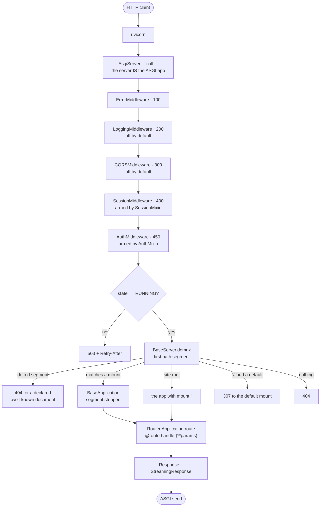
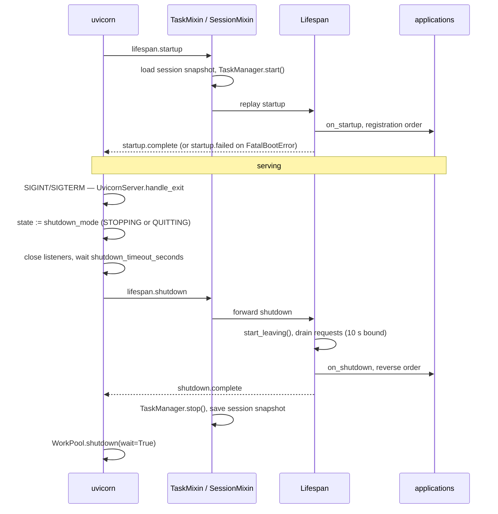
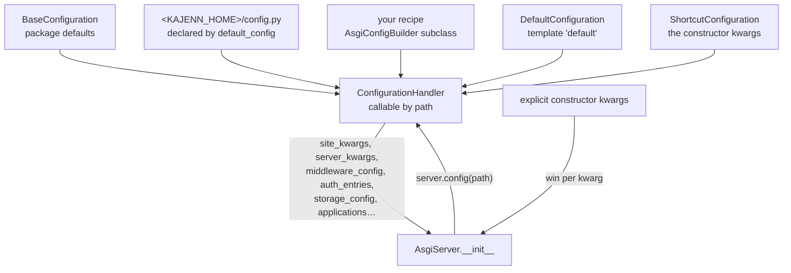
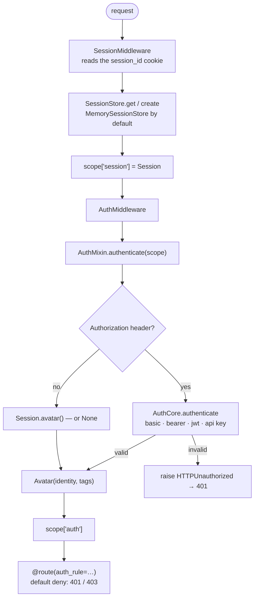
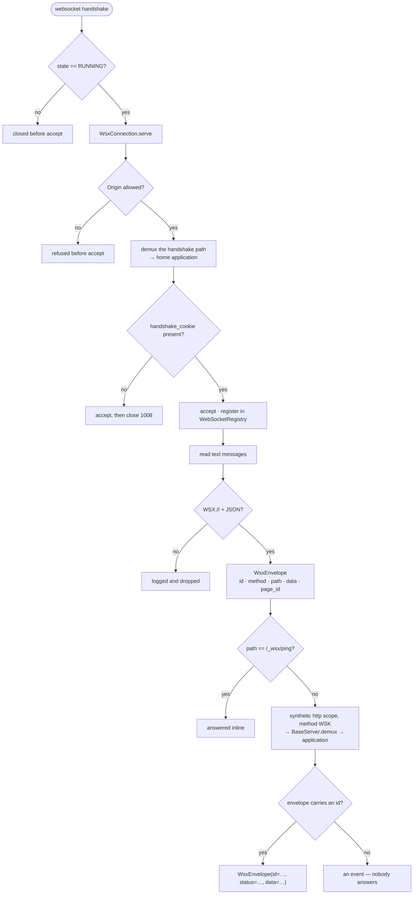
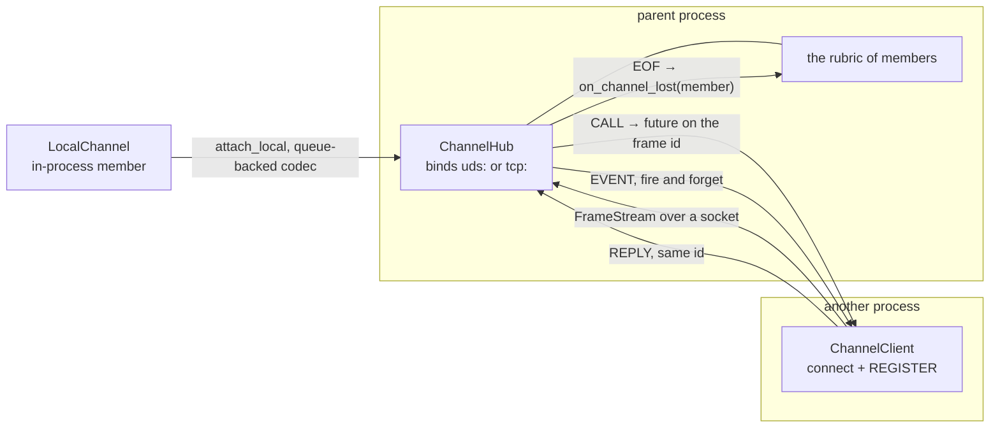
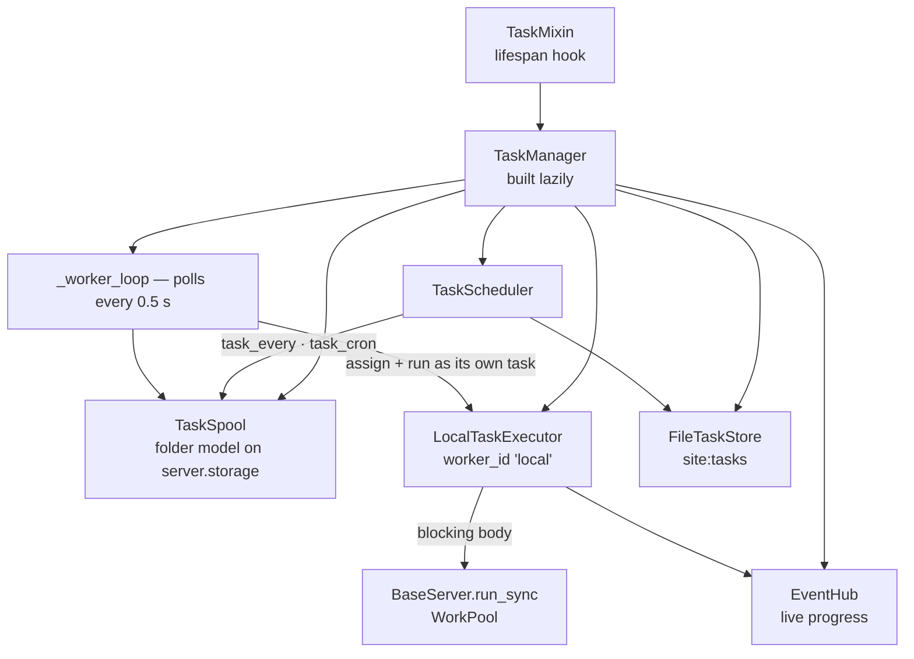

# Architecture overview

This page explains how kajenn is put together: what runs when a request
arrives, what the server owns, and how each subsystem reaches the next. Every
diagram below is drawn from the modules named under it, and each is followed by
the classes it shows with the module they live in. The normative source is
[`SPECIFICATION.md`](https://github.com/kajenn-org/kajenn/blob/main/SPECIFICATION.md)
(the decision log, D1…); this page summarizes it and never contradicts it.

## Core principles

These are the guiding principles of the design (SPECIFICATION.md §1). They
explain most of the decisions you will meet in the code.

- **No globals.** The server is an instance with its own state — no
  module-level variables, no singletons. State lives in objects connected by
  semantic parent references. Releasing resources is the lifespan shutdown's
  job; dropping a reference does not stop active tasks, threads or child
  processes.
- **Config is data, not structure.** What a server *is* comes from a
  configuration recipe rendered onto it; the code shape does not change with
  the deployment.
- **Objects always exist; backends come from config.** There is no `X | None`
  attribute a flag flips on. The session store, the auth core and the task
  manager are always there — configuration selects their *backend*.
- **Work at the time of use.** Expensive machinery (the thread pool, the task
  manager) is provisioned lazily, on first use.
- **Routes are static from boot.** The routing tree is built once; routing is
  never used as a mutable registry.
- **Extension by subclassing; capabilities as mixins.** You add behaviour by
  subclassing an application, and the server composes capabilities (auth,
  session, tasks…) as mixins over a base.

## (a) The request path

`AsgiServer` (`src/kajenn/asgi_server.py`) is the ASGI callable uvicorn is
handed; there is no separate app object. `MiddlewareMixin`
(`src/kajenn/middleware/__init__.py`) routes only `http` scopes through the
chain it assembled once with `build_chain` (`src/kajenn/middleware/base.py`);
`lifespan` and `websocket` scopes go straight down the MRO. The chain order is
each class's `middleware_order`, lowest outermost: `ErrorMiddleware` 100
(`errors.py`), `LoggingMiddleware` 200 (`logging.py`), `CORSMiddleware` 300
(`cors.py`), `SessionMiddleware` 400 (`session.py`), `AuthMiddleware` 450
(`authentication.py`). Only `errors` carries `middleware_default = True`;
`session` and `auth` are armed by `SessionMixin` and `AuthMixin`, which inject
their switch into the `middleware` config as they forward it down the
cooperative `__init__` chain.

`BaseServer.__call__` (`src/kajenn/server.py`) reads `state` first: anything but
`RUNNING` answers 503 with `Retry-After` and registers nothing. `BaseServer.demux`
then applies the one dispatch rule, and `RequestRegistry`
(`src/kajenn/request_registry.py`) holds the request for the span of the
dispatch. `RoutedApplication` (`src/kajenn/routed_application.py`) builds a
`Request` (`src/kajenn/request.py`), awaits `init()` and calls the
`@route`-decorated method through its genro-routes router; the return value
becomes a `Response` (`src/kajenn/response.py`) or a `StreamingResponse`
(`src/kajenn/streaming.py`).

## (b) Lifespan and shutdown

`UvicornServer` (`src/kajenn/server.py`) owns the signal handlers: the first
SIGINT or SIGTERM turns `state` to `shutdown_mode` *before* raising uvicorn's
exit flag, so the whole graceful window is served by a server that already
refuses new work. `Lifespan` (`src/kajenn/lifespan.py`) then calls
`start_leaving()`, waits for the in-flight requests through
`RequestRegistry.await_drain` bounded by `SHUTDOWN_DRAIN_TIMEOUT_SECONDS`
(10.0), and only then runs `on_shutdown` in reverse registration order. A hook
that raises is logged and the sequence continues; `FatalBootError` raised from
`on_startup` is the one exception — the startup stops there and uvicorn
receives `lifespan.startup.failed`.

`TaskMixin` and `SessionMixin` (`src/kajenn/tasks/mixin.py`,
`src/kajenn/session/mixin.py`) wrap the lifespan scope in their own `__call__`
instead of touching `Lifespan`: the task manager starts before the protocol is
replayed and stops when it completes, and the session snapshot is loaded before
and saved after. `BaseServer.__call__` tears the `WorkPool`
(`src/kajenn/pool.py`) down once the protocol is acked.

## (c) Configuration

A configuration is a recipe: a subclass of `AsgiConfigBuilder`
(`src/kajenn/config/builder.py`) whose `main(root)` opens the `configuration`
root and delegates each section to its own method. `DefaultConfig`
(`src/kajenn/config/default_config.py`) computes the parent chain — the
package's `BaseConfiguration` first, then the file the recipe's
`default_config` attribute declares (by default `<base_dir>/config.py`, layered
only when it exists), with the site's own recipe last and winning. `base_dir`
resolves as the explicit argument, then `KAJENN_HOME`, then `~/.kajenn`.

`ConfigurationHandler` (`src/kajenn/config/handler.py`) is the read door:
callable by path over a four-layer stack — the written value, the element
signature's default, the call-site `default=`, then a `KeyError` naming the
path. `AsgiServer.__init__` asks it for one kwarg set per section and merges
the caller's explicit kwargs over them, wholesale per kwarg. A server built
with kwargs alone has a configuration too: `ShortcutConfiguration`
(`src/kajenn/config/templates.py`) writes those kwargs as the top layer over
the `default` template, so `server.config` is a handler in every case. An
application holds an address in that tree: `app.config(path)` prefixes
`applications.<code>.` and delegates to the same door.

## (d) Sessions and authentication

`SessionMiddleware` (`src/kajenn/middleware/session.py`) reads the cookie,
reconnects or creates an anonymous `Session` (`src/kajenn/session/session.py`)
through `SessionStore` (`src/kajenn/session/store.py`), and attaches it to the
scope. It sets `Set-Cookie` only on the response that created the session; the
cookie's `Max-Age` is the session TTL times `COOKIE_LIFETIME_FACTOR` (24),
because the server-side TTL slides with activity while `Max-Age` is fixed from
issue time.

`AuthMiddleware` (`src/kajenn/middleware/authentication.py`) delegates the whole
verdict to `AuthMixin.authenticate` (`src/kajenn/auth/mixin.py`) and publishes
the result on `scope["auth"]`. The precedence is API-first: an `Authorization`
header is judged by `AuthCore` (`src/kajenn/auth/core.py`) and wins, and a
credential that is present but invalid raises `HTTPUnauthorized` rather than
falling back; with no header the session's root avatar is used. "Nobody" is
`None` uniformly — there is no anonymous `Avatar`
(`src/kajenn/session/avatar.py`). Because `SessionMiddleware` (400) sits outside
`AuthMiddleware` (450), the session is already on the scope when that fallback
runs. Identity stores are declared, never handed over: `FileUserStore` and
`FileApiKeyStore` (`src/kajenn/auth/user_store.py`,
`src/kajenn/auth/api_key_store.py`) are built by the mixin over the server's
storage, and the server creates no user at boot.

## (e) WebSocket and the WSX envelope

`BaseServer.on_websocket` (`src/kajenn/server.py`) judges the server state
first, then hands the socket to one `WsxConnection` (`src/kajenn/wsx.py`), which
lives the whole connection: it gates the handshake, accepts, reads messages and
answers the ones carrying an `id`. `WebSocket` (`src/kajenn/websocket.py`) is
the transport underneath — the ASGI scope, `receive` and `send` as one object —
and `WebSocketRegistry` holds the live sockets plus the `page_id → socket`
association a client writes with `/_wsx/openchannel`.

A WSX message is the text `WSX://` followed by JSON; `WsxEnvelope` is that
message as an object. Its `data` field carries a TYTX string kept serialized
while routing (`SerializedWsxPayload`, `src/kajenn/wsx_payload.py`). Every
message with an `id` becomes a synthetic HTTP scope with the method `WSK` and
goes through the server's ordinary demux, so an application learns no new
method. The HTTP middleware chain does not run on the handshake or per message:
identity and session are read once at the handshake and travel with every
message. A hostile Origin is refused before the accept; an unknown home
application or a missing `handshake_cookie` is accepted and then closed 1008.
`WEBSOCKET_MAX_CONCURRENT` (16, overridable with `websocket(max_concurrent=…)`)
bounds how many messages of one connection are served at once, and
`server.send_message(page_id, path, data)` writes one message of the server's
own onto a bound socket.

## (f) The channel between processes

The channel (`src/kajenn/channel/`) is the seam the core offers for running
application code in another process; nothing in it reaches up to whoever spawns
that process. `Frame` and `FrameStream` (`frame.py`) are the wire: the magic
`KJNF`, a version byte and two big-endian unsigned 32-bit lengths (`!4sBII`),
then JSON routing info, then opaque payload bytes the frame layer never
interprets. `ChannelHub` (`hub.py`) is the parent end — it binds the socket,
keeps the rubric of registered members and routes the three envelope kinds
`CALL`, `REPLY` and `EVENT`. `ChannelClient` (`client.py`) is the child end: it
retries the connect until `connect_timeout`, presents a `REGISTER` frame and
relays frames both ways; there is no steady-state reconnection, so a hub that
goes away fires `on_orphan(client)`. `LocalChannel` (`local.py`) joins the same
rubric in-process over a queue-backed codec twin.

Over that wire, `RemoteApplication` (`src/kajenn/remote_application.py`) mounts
one application served by an endpoint in another process, and
`RemoteApplicationRunner` (`src/kajenn/remote_runner.py`) is that endpoint.
Both sides carry the HTTP call as an `HttpRecord` (`src/kajenn/http_record.py`)
and call the application through `BufferedAsgiEndpoint`
(`src/kajenn/asgi_endpoint.py`). The wire limits are environment policy, read by
`src/kajenn/transport_limits.py` — see [the channel protocol](../design/channel-protocol.md).

## (g) Tasks

`TaskMixin` (`src/kajenn/tasks/mixin.py`) peels the `tasks=` kwarg and hooks the
lifespan; the `TaskManager` (`src/kajenn/tasks/manager.py`) is built on first
access, never in `__init__`, because it opens its spool over `server.storage`
and the cooperative chain has not assigned that yet. The manager owns the
`TaskSpool` (`spool.py`), the `LocalTaskExecutor` (`executor.py`), the
`EventHub` (`hub.py`), the `TaskScheduler` (`scheduler.py`) and the
`FileTaskStore` (`store.py`). `start()` launches two loops on the running event
loop — the fire-and-forget worker loop, which polls the pending queue every
`POLL_SECONDS` (0.5), assigns each task to `worker_id` (`"local"`) and launches
its execution as a task of its own, and the scheduler's tick loop for the
cadences `AtSpec`, `EverySpec` and `CronSpec` (`schedule.py`). The D2 thread
pool is reserved for the blocking handler body inside `execute`, reached through
`server.run_sync`; the loops themselves never block it.

## The two layers: server and application

`BaseServer` (`src/kajenn/server.py`) is the common substrate of every server
(SPECIFICATION.md §4, D2). It owns one uvicorn loop, one monitored thread pool
for blocking work, the applications it was composed with (a dict keyed by each
app's `code`, plus an index by `mount`), the lifespan and the request registry.
At the base, `authenticate()` and `session()` answer `None` — auth and sessions
are capabilities layered on top, not built into the base.

`AsgiServer` (`src/kajenn/asgi_server.py`) is the shipped composition: it stacks
`CommunicationMixin`, `AuthMixin`, `SessionMixin`, `MiddlewareMixin`,
`PluginMixin`, `StorageMixin` and `TaskMixin` over `BaseServer` in one MRO.
`TaskMixin` sits after `StorageMixin` because it needs `server.storage`, and
before `BaseServer` because its lifespan hook must wrap the base `Lifespan`.
You configure a capability through a constructor kwarg; each mixin peels the
kwargs it understands and forwards the rest down the cooperative `__init__`
chain. A composition that leaves a mixin out simply lacks its attributes.

`BaseApplication` (`src/kajenn/application.py`) is the app-side contract: an
ASGI callable with a `code` (its identity), a `mount` (the URL prefix it answers
under) and a `server` reference assigned once at attach time — a second
assignment raises. `RoutedApplication` (`src/kajenn/routed_application.py`)
wires [genro-routes](https://pypi.org/project/genro-routes/) into it, so
handlers are `@route`-decorated methods resolved through the app's own router.
`OpenApiApplication`, `McpApplication` and `McpOpenApiApplication`
(`src/kajenn/applications/`) add protocol faces over the *same* route tree,
which is why one decorated method can serve REST and MCP at once.

## The `_server` application

`ServerApplication` (`src/kajenn_server_app/server_app.py`) carries the server's
own management surface — login, users, tokens, tasks, monitor — under
`/_server/…`, with its OpenAPI schema at `/_server/_meta/schema_json`. It is
declared like any other application, with the code `_server`: a hand-built
server passes it in `applications=`, a configured one writes it on the
`applications` section. Nothing mounts it behind the caller's back, and a server
that declares none exposes no `/_server/…` at all. `import kajenn` loads none of
that package.

## Where to go next

- [Getting started](../getting-started.md) — install and run.
- [Concepts](../concepts.md) — the same model in more practical terms.
- [The channel protocol](../design/channel-protocol.md) — the frame contract and
  the environment policy that bounds it.
- [`SPECIFICATION.md`](https://github.com/kajenn-org/kajenn/blob/main/SPECIFICATION.md)
  — the full decision log.
