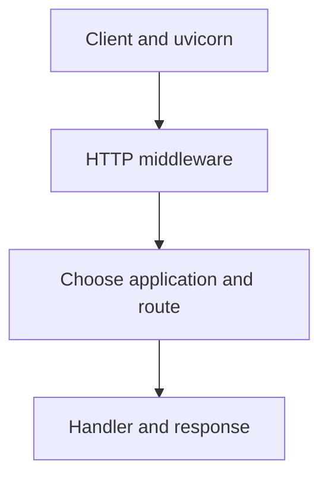
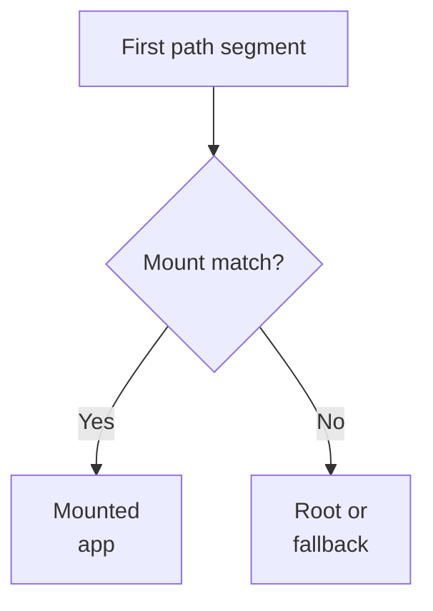
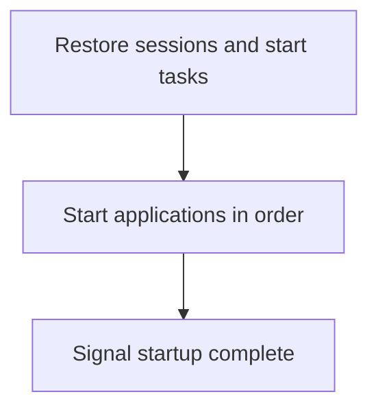
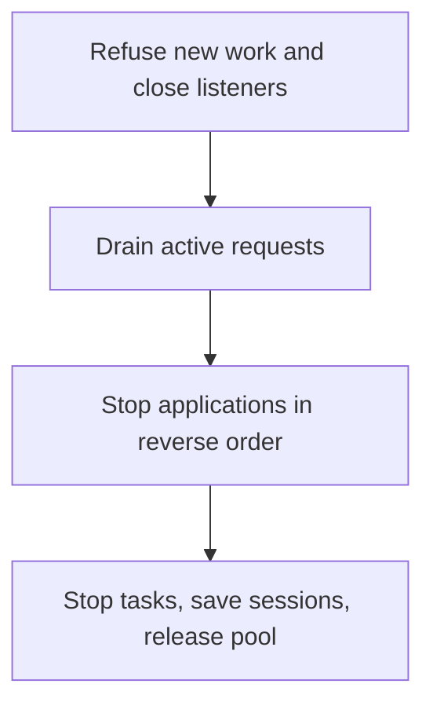
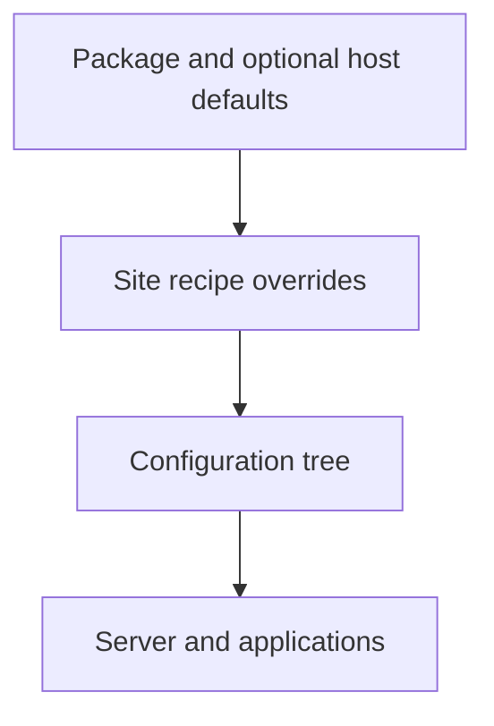
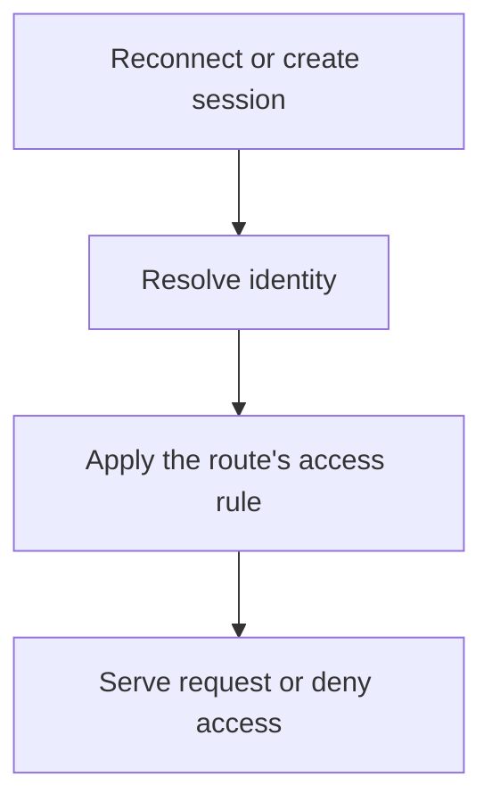
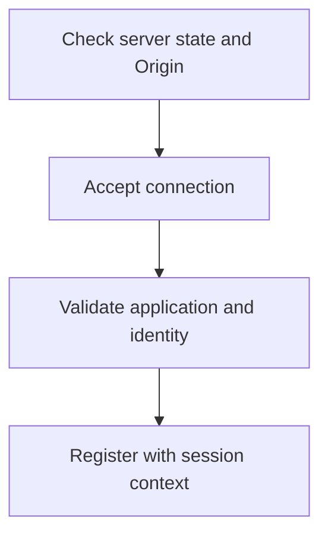
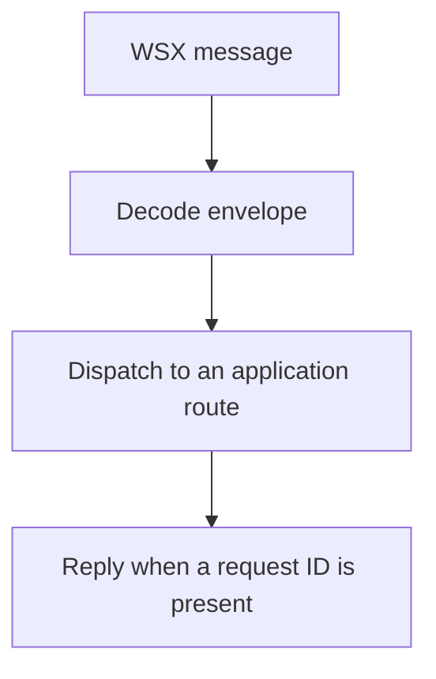
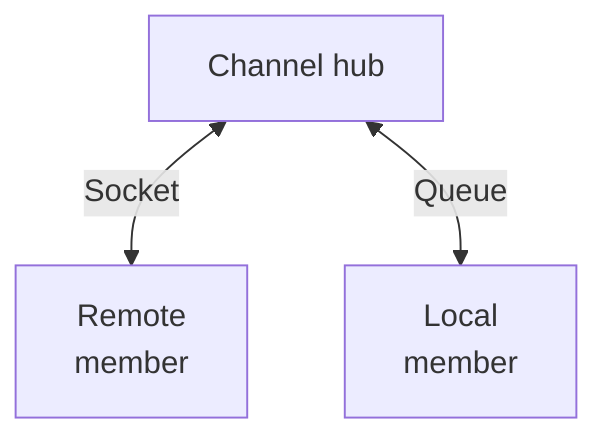
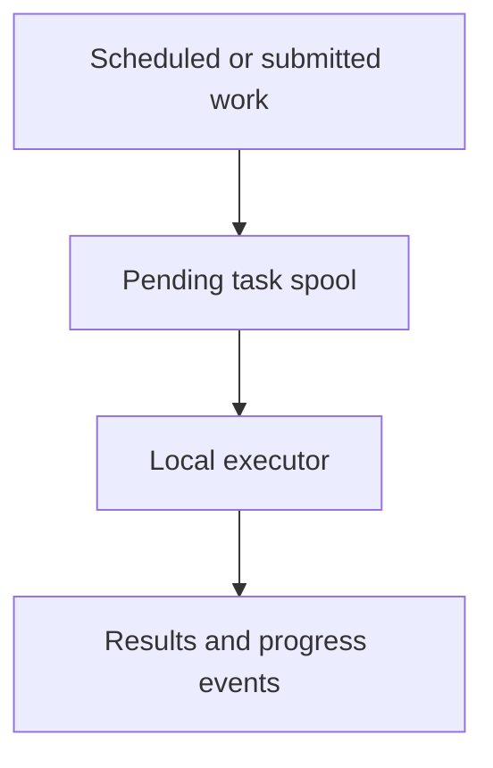

# Architecture overview

kajenn receives a request, selects an application and sends its response.
The server also owns the resources shared by those applications: configuration,
storage, sessions, authentication and background work.

This page follows those responsibilities one at a time. Start with the request
path; the remaining sections explain the supporting services. For exact classes
and modules, use the [source map](#source-map) at the end.

## Core principles

- **State belongs to a server instance.** Each instance owns its resources;
  shutdown releases active tasks, threads and connections.
- **Configuration describes the deployment.** Recipes select settings and
  backends without changing the application's structure.
- **Resources are created when needed.** Expensive services such as the thread
  pool and task manager are initialized on first use.
- **Routes are established at startup.** The route tree describes the
  application; it is not a registry of changing runtime state.
- **Capabilities compose.** Applications extend base classes; server mixins
  contribute services such as authentication, storage and tasks.

(a-the-request-path)=
## The request path

uvicorn handles the network connection and calls the kajenn server as an ASGI
application. kajenn applies HTTP middleware, chooses the mounted application
and calls its handler. The response travels back through the middleware.

### What the middleware does

Middleware wraps the dispatch. Lower priority numbers run on the outside of
the chain, so error handling can also catch failures from the inner stages.

| Stage | Priority | Responsibility | Activation |
| --- | --- | --- | --- |
| Errors | 100 | Turn HTTP errors into responses | Enabled by default |
| Logging | 200 | Record requests | Opt-in |
| CORS | 300 | Apply cross-origin policy | Opt-in |
| Session | 400 | Attach the session | Session capability |
| Authentication | 450 | Resolve the caller's identity | Authentication capability |

This chain applies to HTTP requests. WebSocket and lifespan events have their
own paths through the server.

### How the application is selected

The server first checks whether it is running. Otherwise it returns **503**
with a Retry-After header, without registering new work.

For an ordinary path, dispatch starts with its first segment:

| Case | Result |
| --- | --- |
| A segment matches a mount | Dispatch to that application with the mount segment removed |
| No mount matches, but a root application exists | Dispatch to the root application |
| The path is `/`, with a default application and no root application | Redirect to the default mount with 307 |
| No application can handle the path | Return 404 |
| A hidden, dotted segment is requested | Return 404, except for a declared .well-known document |

Once selected, a routed application builds the request and calls the decorated
handler. Its result becomes a normal or streaming response. The request registry
tracks the dispatch until it finishes, allowing shutdown to wait for active work.

See the [application](../guides/applications.md) and
[middleware](../guides/middleware.md) guides for configuration and examples.

(b-lifespan-and-shutdown)=
## Startup and shutdown

Startup prepares the shared services before applications begin serving requests.
Application startup hooks run in registration order.

Shutdown reverses that progression. The first termination signal changes the
server state immediately, so it refuses new work during the graceful shutdown
window.

There are two waiting stages: uvicorn's configured graceful timeout and the
lifespan request drain, bounded at 10 seconds. A failing shutdown hook is logged
and later hooks still run. A fatal startup error stops startup and reports its
failure to uvicorn.

The task and session capabilities wrap the lifespan protocol. They prepare
before application startup and clean up after the protocol completes. The
thread pool is released last. See [lifecycle](../guides/lifecycle.md).

(c-configuration)=
## Configuration

A Python recipe builds a configuration tree. The server reads that tree to
assemble its capabilities and applications.

Two kinds of precedence are involved:

- **Recipe layers:** package defaults, optional host configuration, then the
  site recipe. Later layers override individual attributes.
- **Value reads:** an explicit value, then the grammar default, then a
  call-site default. If none exists, the read raises a missing-path error.

Explicit constructor arguments override configured arguments when the server
is built, one complete argument at a time. They do not rewrite a supplied
recipe. Even a server built using only constructor arguments has a configuration
handler: those arguments are translated into a shortcut recipe.

Applications read relative to their own section of the same tree. Start with
[Configuration is part of the application](../configuration.md) for the rationale
and a complete example; the [configuration guide](../guides/configuration.md)
explains loading, defaults and overrides.

(d-sessions-and-authentication)=
## Sessions and authentication

A session reconnects requests from the same client. Authentication determines
which identity, if any, is making the request. Session middleware runs first so
authentication can use the session when no authorization header is supplied.

| Credentials supplied | Identity used |
| --- | --- |
| Valid Authorization header | Identity returned by the authentication backend |
| Invalid Authorization header | Reject with 401; do not fall back to the session |
| No Authorization header | Session identity, or no identity |

The session middleware sets a cookie when it creates the session. Server-side
expiry slides with activity; the cookie's lifetime is fixed when issued and is
24 times the session TTL.

The authentication capability builds configured user and API-key stores over
server storage. It creates no user automatically. Routes apply their own access
rules; denied access produces 401 or 403 as appropriate.

See [sessions](../guides/sessions.md) and
[authentication](../guides/authentication.md) for setup and policy.

(e-websocket-and-the-wsx-envelope)=
## WebSocket and WSX

A WebSocket remains open for multiple messages. An application can own the raw
protocol, or use kajenn's WSX connection to route messages to application handlers.
The following flow describes WSX.

### Establish the connection

| Handshake condition | Outcome |
| --- | --- |
| Server is not running, or Origin is disallowed | Refuse before accepting |
| Unknown home application, missing required cookie or rejected credentials | Accept, then close with code 1008 |
| Checks succeed | Keep the connection and its session context |

### Dispatch messages

A WSX message starts with `WSX://`, followed by JSON. The envelope carries a
path, an optional request ID and a payload. The payload remains serialized while
routing; application dispatch uses a synthetic HTTP scope with method `WSK`.

Malformed messages are logged and dropped. Ping messages are answered directly.
Messages without an ID are events and receive no reply. By default, a connection
serves at most 16 messages concurrently; the WebSocket configuration can change
that limit.

HTTP middleware runs neither at the handshake nor for each message. Session and
identity are established at the handshake and carried with subsequent messages.
A page can bind its ID to a live socket so the server can send it messages.
See the [WebSocket guide](../guides/websockets.md) for the raw protocol option,
message format and runnable clients.

(f-the-channel-between-processes)=
## Communication between processes

The channel lets an application endpoint run in another process. The core
provides communication; the component that launches the process is separate.

The hub listens on a Unix or TCP socket and tracks registered members. A remote
client connects and registers; an in-process member uses a queue-backed channel.

| Message | Purpose |
| --- | --- |
| CALL | Request work and wait for a result |
| REPLY | Return the result with the same frame ID |
| EVENT | Send a notification without waiting for a reply |

Connection attempts are retried until the connection timeout. Once connected,
losing the hub reports an orphaned client; it does not silently reconnect.

A remote application forwards HTTP calls to a runner through this channel.
Both ends use an HTTP record and a buffered ASGI endpoint. The frame format,
payload handling and transport limits belong in the
[channel protocol reference](../design/channel-protocol.md).

(g-tasks)=
## Background tasks

The task manager coordinates pending work, scheduled work and execution. It is
created on first access, after server storage is available.

| Component | Responsibility |
| --- | --- |
| Spool and task store | Persist pending work and task records on server storage |
| Scheduler | Submit work at a time, interval or cron schedule |
| Worker loop | Poll pending work every 0.5 seconds and launch executions |
| Local executor | Run the task; send blocking handler work to the thread pool |
| Event hub | Publish progress to subscribers |

The worker and scheduler loops run on the event loop. Each execution gets its
own asynchronous task; only the blocking handler body uses the thread pool.
The lifespan starts and stops the manager. See [background tasks](../guides/tasks.md).

## Server and application responsibilities

| Layer | Owns |
| --- | --- |
| Base server | Event loop, thread pool, mounted applications, lifespan and request registry |
| Composed ASGI server | Configuration plus communication, authentication, sessions, middleware, plugins, storage and tasks |
| Base application | An ASGI callable, its identity, URL mount and attached server reference |
| Routed application | Decorated handlers resolved through its route tree |
| Protocol applications | OpenAPI and MCP views over the same route tree |

Server mixins consume the configuration arguments they understand and forward
the rest. Their ordering matters: tasks depend on storage and must wrap the
base lifespan. A composition that omits a capability does not acquire that
capability's attributes.

An application's server reference is assigned once when it is attached.
Its code identifies it within the server; its mount determines its URL prefix.
The base server itself supplies no identity or session: those come from the
corresponding capabilities.

## The management application

The optional server application exposes login, users, tokens, tasks and
monitoring under `/_server/`. Its OpenAPI schema lives at
`/_server/_meta/schema_json`.

It must be declared in the application list or recipe, with code `_server`.
Nothing mounts it implicitly: a server without that declaration exposes no
management application. Importing the core does not load the management package.

## Source map

Use these entry points when you want to follow the implementation. Class names
and file paths are kept here so the explanations above can focus on behaviour.

| Area | Source entry points |
| --- | --- |
| Server and dispatch | [AsgiServer](https://github.com/kajenn-org/kajenn/blob/main/src/kajenn/asgi_server.py), [BaseServer](https://github.com/kajenn-org/kajenn/blob/main/src/kajenn/server.py), [request registry](https://github.com/kajenn-org/kajenn/blob/main/src/kajenn/request_registry.py) |
| HTTP middleware | [Composition](https://github.com/kajenn-org/kajenn/blob/main/src/kajenn/middleware/__init__.py), [chain builder](https://github.com/kajenn-org/kajenn/blob/main/src/kajenn/middleware/base.py) |
| Requests and responses | [RoutedApplication](https://github.com/kajenn-org/kajenn/blob/main/src/kajenn/routed_application.py), [Request](https://github.com/kajenn-org/kajenn/blob/main/src/kajenn/request.py), [Response](https://github.com/kajenn-org/kajenn/blob/main/src/kajenn/response.py), [streaming](https://github.com/kajenn-org/kajenn/blob/main/src/kajenn/streaming.py) |
| Lifecycle | [Lifespan](https://github.com/kajenn-org/kajenn/blob/main/src/kajenn/lifespan.py), [thread pool](https://github.com/kajenn-org/kajenn/blob/main/src/kajenn/pool.py) |
| Configuration | [Recipe builder](https://github.com/kajenn-org/kajenn/blob/main/src/kajenn/config/builder.py), [layering](https://github.com/kajenn-org/kajenn/blob/main/src/kajenn/config/default_config.py), [handler](https://github.com/kajenn-org/kajenn/blob/main/src/kajenn/config/handler.py), [templates](https://github.com/kajenn-org/kajenn/blob/main/src/kajenn/config/templates.py) |
| Sessions and identity | [Session capability](https://github.com/kajenn-org/kajenn/blob/main/src/kajenn/session/mixin.py), [session store](https://github.com/kajenn-org/kajenn/blob/main/src/kajenn/session/store.py), [authentication](https://github.com/kajenn-org/kajenn/blob/main/src/kajenn/auth/mixin.py), [auth core](https://github.com/kajenn-org/kajenn/blob/main/src/kajenn/auth/core.py) |
| WebSocket | [WSX connection](https://github.com/kajenn-org/kajenn/blob/main/src/kajenn/wsx.py), [transport](https://github.com/kajenn-org/kajenn/blob/main/src/kajenn/websocket.py), [payload](https://github.com/kajenn-org/kajenn/blob/main/src/kajenn/wsx_payload.py) |
| Remote applications | [Channel](https://github.com/kajenn-org/kajenn/tree/main/src/kajenn/channel), [application](https://github.com/kajenn-org/kajenn/blob/main/src/kajenn/remote_application.py), [runner](https://github.com/kajenn-org/kajenn/blob/main/src/kajenn/remote_runner.py), [HTTP record](https://github.com/kajenn-org/kajenn/blob/main/src/kajenn/http_record.py) |
| Tasks | [Capability](https://github.com/kajenn-org/kajenn/blob/main/src/kajenn/tasks/mixin.py), [manager and collaborators](https://github.com/kajenn-org/kajenn/tree/main/src/kajenn/tasks) |
| Applications | [Base contract](https://github.com/kajenn-org/kajenn/blob/main/src/kajenn/application.py), [protocol views](https://github.com/kajenn-org/kajenn/tree/main/src/kajenn/applications), [management application](https://github.com/kajenn-org/kajenn/blob/main/src/kajenn_server_app/server_app.py) |

## Where to go next

- [Concepts](../concepts.md) — the model with practical examples.
- [How-to guides](../guides/index.md) — configure and use each capability.
- [Specification](https://github.com/kajenn-org/kajenn/blob/main/SPECIFICATION.md)
  — the founding decisions and their rationale.
