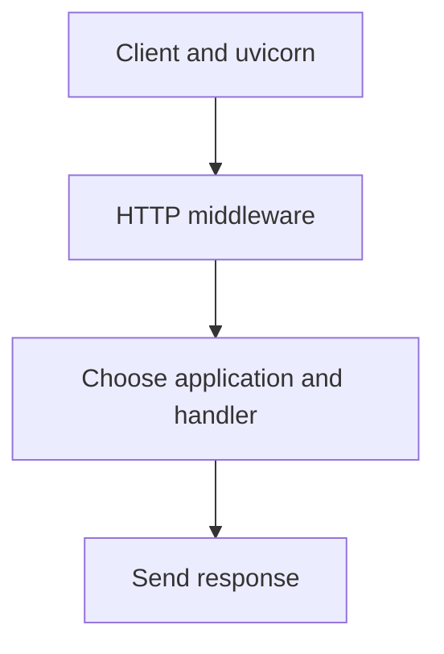

# Core Concepts

This page explains the model behind kajenn: how a server relates to the
applications it serves, how a request finds its handler, and the design
principles that make the whole thing predictable. Read it once and the how-to
guides will read like footnotes.

## The server / application model

kajenn separates two roles cleanly:

- A **server** owns the runtime: one uvicorn loop, the middleware chain, the
  request registry, lifespan, and the set of applications it serves.
- An **application** owns behaviour: a tree of `@route`-decorated methods that
  answer requests. An application knows nothing about ports or middleware.

### Applications: code and mount

There is one category of application, not two. A server is composed with the
applications it serves, and each one carries both halves of its own identity:

- its **`code`** is its name — the key of `server.applications`, defaulting to
  the class name lowercased;
- its **`mount`** is the URL prefix it answers under, defaulting to the `code`.

`mount = ""` is the **site root**: that application answers `/` and every path
no other mount claims. It is a value like any other, not a missing one — and no
application is obliged to take it.

The following composition fragments assume the imports from the quick start
and your own `Api` and `Admin` application classes. They illustrate placement,
not complete runnable applications.

```python
class Shop(RoutedApplication):
    mount = ""          # answers / and everything unclaimed


server = AsgiServer(applications=[Shop, (Api, {"code": "api"})])
# GET /orders      → Shop
# GET /api/orders  → Api, which receives /orders
```

Because the code and the placement are distinct, the same class can be served
twice under different names, using entries such as
`(Shop, {"code": "outlet", "mount": "outlet"})` in `applications`.

### The one demux rule

There is a single rule for dispatching a request to an application, the same on
every server:

> **First path segment → the application mounted there, if one is;
> else the application on the site root, if there is one;
> else, for `/` itself with a `default` declared, a **307** to that
> application's mount;
> else **404**.**

A server with one application on the root is a *usage* of this rule, not a
different mechanism — and so is a server of mounts only, with nothing on the
root:

```python
server = AsgiServer(
    applications=[(Api, {"code": "api"}), (Admin, {"code": "admin"})], default="api"
)
# GET /api/orders  → Api
# GET /admin/users → Admin
# GET /            → 307 to /api/   (no default → 404)
# GET /anything    → 404            (the default answers the root, it is not a catch-all)
```

`default` names an application by **code** and redirects `/` to its mount. It
elects nothing and it is consulted only when the root is unclaimed: 307, so the
method and the body survive the hop.

### The `_server` app

The management surface — login, monitoring, OpenAPI of system endpoints, task
management — is `ServerApplication`, and it is declared like any other
application, with the code `_server`. A server that does not declare it does not
have it. Its endpoints live under `/_server/...` and never leak into your own
app's route tree.

## Routing with genro-routes

Routing is delegated to **genro-routes**, a protocol-neutral routing library.
This is a deliberate choice: because the route tree does not know whether it is
being called over REST, OpenAPI, or MCP, the *same* tree can be exposed through
several transports. It is the reason OpenAPI and MCP applications reuse your
ordinary `@route` methods rather than duplicating them.

### `@route`

Import the decorator from `genro_routes`:

```python
from genro_routes import route
```

Key forms you will use across the guides:

- `@route()` — publish a method as an endpoint; its name is the URL segment.
- `@route(media_type="text/html")` — respond as HTML instead of JSON.
- `@route(auth_rule="admin")` — protect the endpoint (see below).
- `@route(channel_channels="mcp")` — also expose the method as an MCP tool.
- `@route(task="cleanup", task_every="1s")` — register the method as a scheduled
  task.

### `auth_rule` and default-deny

An **avatar** is the caller’s identity and authorization tags.
A route carrying `auth_rule="admin"` is protected: the caller's avatar must carry
the matching tag. Protection is **default-deny**: an anonymous caller gets `401`, including when
no auth middleware is configured; an authenticated caller with insufficient
tags gets `403`. The [authentication
guide](guides/authentication.md) covers the credential side.

## Requests and responses

- `Request.init()` reads and decodes the complete body before a routed handler
  runs. Query and form fields become handler arguments. A handler can accept a JSON
  object as `body_data`, or declare scalar parameters that the validation plugin
  fills from matching JSON keys.
  See [Requests and errors](guides/requests.md) for multipart uploads and validation.
- Return a `dict` for JSON or a string with `media_type="text/html"` for HTML.
  A `Response` is an ASGI callable for applications that handle the ASGI triple
  directly; returning it from a routed handler does not send it as a response.
- For incremental HTTP output, return a `StreamingResponse`, or the result of
  `SseStream.response()` (see [streaming](guides/streaming.md)).

Both `Request` and `Response` are importable from `kajenn`.

## Advanced: how capabilities compose

### `BaseServer` and `AsgiServer`

`BaseServer` is the minimal substrate every server shares: the uvicorn loop, a
monitored thread pool for blocking work, the applications it serves,
lifespan, and the request registry.

`AsgiServer` is the shipped, batteries-included server. It is a **composition of
capability mixins** stacked over `BaseServer` in a single MRO — communication,
auth, session, middleware, plugins, storage, and tasks. Each mixin contributes a
feature configured through constructor keyword arguments. Sessions, auth
middleware and the task backbone are active on the shipped composition.
This is a configuration sketch: replace the ellipses with real option dictionaries
and provide your application class before running it.

```python
server = AsgiServer(
    applications=[App],
    auth={...},          # configures header credentials
    middleware={...},    # arms other middleware
    tasks=True,          # default; False disables the task backbone
    plugins={...},       # tunes fixed OpenAPI / pydantic plugins and adds extras
)
```

A mixin is a class contributing one capability to the combined server. Python
uses its method resolution order (MRO) to compose those classes. Most applications
only need the shipped AsgiServer: configure its capabilities rather than build a
new composition. Activation and resource creation are separate; for example,
the task manager is lazy and accessing it with tasks disabled raises an error.

## Design principles

kajenn is a spec-first redesign; its principles are ratified in
[`SPECIFICATION.md`](https://github.com/kajenn-org/kajenn/blob/main/SPECIFICATION.md).
Three of them govern almost every API decision:

- **No globals — state lives in instances.** There is no module-level server and
  no ambient request. A server is an object you build; its components reach each
  other through an explicit parent reference (an application holds
  `self.server`, a request holds `self.application`). Each server owns its runtime objects; shared external storage and explicitly
  supplied collaborators still require deliberate isolation.
- **Config is data, not structure.** You describe what you want with plain data
  (dicts, config-builder calls) and hand it to objects that already exist. You do
  not restructure code to switch a backend; you change the data.
- **Objects always exist; backends come from config.** A capability is not an
  `X | None` that a flag flips on. The session subsystem, the auth subsystem, the
  task subsystem — they are always present. Configuration decides which backend
  they use. This removes a whole category of "is it enabled?" branching.

Two more shape how you extend the framework:

- **Routes are static from boot** — the route tree is fixed when the server
  starts; routing is never used as a mutable registry.
- **Extension is by subclassing.** You grow an application by subclassing the
  right base (`OpenApiApplication`, `McpApplication`, `SessionMixin`, and so on),
  not by patching instances at runtime.

## The request flow

Putting it together, here is the path an HTTP request travels:



The middleware are ordered by priority (lower number = more outer). The
always-on error middleware wraps everything, which is why an unmatched path or a
raised HTTP exception becomes a clean status code rather than a stack trace. See
the [middleware guide](guides/middleware.md) for the exact chain and how to arm
each stage.

## Where to go next

- **[How-to guides](guides/index.md)** — apply these concepts to concrete tasks.
- **[Getting started](getting-started.md)** — if you skipped the runnable
  hello-world, start there.
- **[Architecture overview](architecture/overview.md)** — the same model with a
  diagram per subsystem and the modules each one lives in.
- [`SPECIFICATION.md`](https://github.com/kajenn-org/kajenn/blob/main/SPECIFICATION.md)
  — the founding decision log, for the full rationale.
