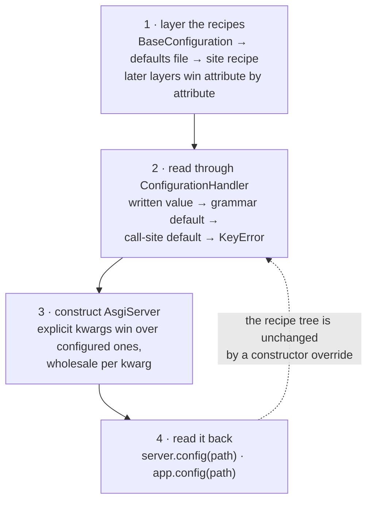

# Configuration

New to recipes? Start with [Configuration is part of the application](../configuration.md)
for the rationale, the comparison with YAML and an example spanning several components.

## What it does

A configuration is a **recipe**: a Python class that writes down what the site is
— the listener, the middleware, the identity surface, the applications — and a
server built from it reads its own values back by path. There is no config file
format to learn: the recipe is code, checked by a grammar that knows which
elements exist and which attributes each one takes.

## When to use it

Use a recipe as soon as the server is more than a demo: it is the one place a
deployment differs, and `kajenn serve ./config.py` turns it into a complete
deployment unit (see [the `kajenn` command](cli.md)). Building the
server by hand — `AsgiServer(applications=[...])` — is the same road written
shorter: the kwargs become a configuration (see below), so a test or a script
declares what a recipe would have declared.

## Setup

Nothing to install. `kajenn.config` ships `AsgiConfigBuilder` (the dialect
you subclass) and `ConfigurationHandler` (the read door the server builds for
itself); `AsgiServer.grammar` is the grammar they validate against.

## At a glance



## The recipe

A recipe subclasses `AsgiConfigBuilder` and overrides `main(self, root)`. `main`
opens the `configuration` root and delegates each section to its own method,
which takes the **parent node**:

```python
from kajenn.config import AsgiConfigBuilder

from myshop.app import Application as Shop


class ServerConfiguration(AsgiConfigBuilder):
    def main(self, root):
        cfg = root.configuration()
        self.server_section(cfg)
        cfg.middleware(cors=True)
        self.applications_section(cfg)

    def server_section(self, cfg):
        """The listener and the session TTL."""
        cfg.server(host="127.0.0.1", port=8000).session(ttl=3600)

    def applications_section(self, cfg):
        """The shop answers the site root."""
        cfg.applications(default="shop").application(
            code="shop", mount="", app_class=Shop
        )
```

Sections are one method each because a section then stays short enough to read
at a glance, and because **the method docstring is where the deployment
explains itself**: the grammar documents what CAN be written, a recipe docstring
documents what THIS instance chose and why. `main` reads as a table of contents.

Every section is a singleton, so its label is its tag and every path below it is
stable and hand-writable: `server.host`, `authentication.credentials`,
`applications.<code>.parameters.<name>`.

## Values that come from outside: resolvers in place

A value the recipe must not contain — a secret, a per-host address — is stored
as a **resolver where the value would go**, and it resolves at read time, so the
runtime always sees the environment's current value:

```python
from genro_bag.resolvers import EnvResolver


def server_section(self, cfg):
    """The port belongs to the host, not to the recipe."""
    cfg.server(
        host="127.0.0.1",
        port=EnvResolver("SHOP_PORT", dtype="L"),
    )
```

The environment gives strings, so a value that is not a string needs
`dtype=` — `dtype="L"` above delivers a real `int` for `port`. There are no
`^pointer` strings in this dialect: the resolver object itself sits in the
attribute.

For secrets this is a convention, not a signature rule: every secret-bearing
attribute accepts a literal and should be given a resolver instead —

```python
cfg.storage(app=StorageManager, storage_key=EnvResolver("SHOP_STORAGE_KEY"))
```

— because a recipe is code you commit, and the key material is not.

## Handing it to the server

`AsgiServer(config=...)` accepts five sources: a recipe **class**, a recipe
**instance**, a **path** to a `config.py`, the **name of a ready-made
configuration**, or a ready `ConfigurationHandler`.

```python
server = AsgiServer(config=ServerConfiguration)          # class
server = AsgiServer(config="/srv/shop/config.py")        # path
server = AsgiServer(config="default")                    # template name
```

## The configuration always exists

A server built with kwargs alone has one too. `AsgiServer(applications=[Shop],
port=8000)` is a **shortcut**: it takes the ready-made `default` configuration
(`DefaultConfiguration`, named in `CONFIGURATION_TEMPLATES`), writes the kwargs
it received into a top layer of its own and runs the same road as a recipe.
`server.config` is a `ConfigurationHandler` here as everywhere, and the tree
carries what a recipe would have written — the `server` section (`debug`
included), the `middleware` and `plugins` switches, and one `application` node
per declared class, so every application reads its own options
(`applications.<code>.request`, and whatever its grammar declares) through the
same door. `applications` entries are CLASSES, or `(class, params)` pairs: the
server instantiates them off the tree, here exactly as for a written recipe, and
an instance is refused by the grammar.

```python
server = AsgiServer(applications=[(Shop, {"mount": ""})], host="0.0.0.0", port=9000)
server.config("server.port")             # 9000 — written into the tree
server.config("applications.shop.mount") # "" — the instance's own placement
```

The `middleware` and `plugins` elements have an OPEN signature, so a switch for
a class registered in code (`middleware_registry=` / `plugin_registry=`) is
written by its own name like any other.

An explicit constructor kwarg **wins over the configured value, wholesale per
kwarg** — the server computes nothing, it just prefers what you passed:

```python
tuned = AsgiServer(config=ServerConfiguration, port=9000)
tuned.config("server.port")   # 8000 — the recipe still says what it said
tuned.config_port             # 9000 — what the server will bind
```

## Layered defaults: `BaseConfiguration` and `default_config`

A site recipe never stands alone: the handler the server builds layers it over
parent recipes, lowest first, the site always last and winning (attribute by
attribute — a section that sets only `port` inherits everything else).

1. **`BaseConfiguration`** — the package's shipped defaults, as a recipe. It
   declares the default storage layout (the `site:` and `home:` mounts) and
   exposes one hook per concern, so the minimal
   deployment is a subclass that sets what deviates:

   ```python
   from genro_bag.resolvers import EnvResolver
   from kajenn import BaseConfiguration


   class Site(BaseConfiguration):
       storage_key = EnvResolver("STORAGE_KEY")   # everything else inherited
   ```

2. **The defaults file** — a recipe the deployment host owns, layered between
   the package defaults and the site. Where it comes from is declared by the
   site recipe itself, through the `default_config` class attribute:

   | `default_config` | meaning |
   |---|---|
   | unset (or `True`) | `<home>/config.py`, layered only when the file exists |
   | `False` | no defaults file — the site sits straight on `BaseConfiguration` |
   | a path | THAT file; a missing path is a loud `ConfigError` at boot |

3. **The site recipe** — always the top layer.

`<home>` here is kajenn's own INSTALLATION directory — the site cards, the
pids, the defaults file, not a site's own home folder — and it resolves as: explicit `base_dir` argument → the **`KAJENN_HOME`**
environment variable → `~/.kajenn`. The variable is how a container or a
virtualenv gets an isolated home (`KAJENN_HOME=$VIRTUAL_ENV/.kajenn`);
nothing is inferred from the environment beyond it. The test suite pins it to
an empty per-test directory, so tests never read a developer's real home.

## Reading it back

The handler is `server.config` and it is **callable by path**:

```python
server.config("server.host")                  # '127.0.0.1'
server.config("server.session.ttl")           # 3600
server.config("openapi.title", default="Shop API")
```

Each read walks four layers, in order:

1. the **written value** — what the recipe put there;
2. the **element's signature default** — `page_size: int = 20` answers 20 even
   when the recipe never wrote it;
3. the **call-site `default=`** — your fallback for a value nobody declared;
4. a **noisy `KeyError`** naming the path and saying which layers were empty:

```
missing config value 'server.nonexistent' (source: 'configuration.server?nonexistent'):
not written by the recipe, no signature default, no call-site default
```

A server built without `config=` still has a configuration handler: constructor
arguments are folded into a shortcut recipe, together with the applicable defaults.

## What an application reads

An application holds an **address** in the tree, never a slice of it:
`app.config(path)` prefixes `applications.<code>.` and delegates to the same
door, so the two reads below are the same read.

```python
class Themed(RoutedApplication):
    mount = ""

    @route()
    def theme(self) -> dict[str, str]:
        return {"theme": self.config("parameters.theme", default="light")}
```

```python
site.config("parameters.theme")                          # 'dark'
server.config("applications.site.parameters.theme")      # 'dark'
```

Every application inherits one element, `parameters`, whose kwargs are free —
enough for a handful of options. An app with a real vocabulary of its own
declares a **grammar**, and `application(app_class=...)` mounts it for that
node's children: the site dialect never validates an app's internal words, the
app itself declares them.

```python
from kajenn.application import ApplicationGrammar
from genro_builders.builder import element


class ShopGrammar(ApplicationGrammar):
    """The shop's own vocabulary, on top of the inherited ``parameters``."""

    @element(node_label="catalog")
    def catalog(self, title: str = None, page_size: int = 20) -> None:
        """Read back as ``applications.<code>.catalog.<attr>``."""


class Shop(RoutedApplication):
    grammar = ShopGrammar
```

The attributes of the `application` envelope itself (`code`, `mount`,
`app_class`, plus the app's constructor kwargs) belong to the site grammar; only
the children live in the mounted one. An undeclared child is a boot error.

## The sections

One line each; the deep dives live in their own guides.

- **`site`** — the site's identity: `name` (the card it is filed under) and
  `home` (the folder it owns, inside which every path is relative and named).
  A recipe usually declares them as the `site_name` / `site_home` class
  attributes, which write this section; the home anchors the default `home:`
  storage volume, beside `site:`. A configuration that carries the name gets its
  card written on the first `serve <path>`. See
  [the site home](cli.md#the-site-home).
- **`server`** — `host`, `port`, `external_url` (the PUBLIC address, not the
  listener), `max_threads`, `shutdown_timeout_seconds` (default 5.0), plus `websocket`
  (`origins`, `max_concurrent`), `session` (its `ttl`) and `tasks` (see [Background tasks](tasks.md)).
- **`middleware`** — one `{name: bool | dict}` switch per middleware; a dict
  enables it and becomes its options (see [Middleware](middleware.md)).
- **`authentication`** — the whole identity surface in one section:
  the `users`/`tokens` stores, the `login` lockout policy, the
  `oidc` providers and the header `credentials`. The grammar of each is in
  [Authentication](authentication.md).
- **`storage`** — the mount point of [genro-storage](https://pypi.org/project/genro-storage/)'s
  own grammar: `storage_key` plus one child per mount, written in genro-storage's
  words (see [The storage section](#the-storage-section)).
- **`applications`** — the app collection keyed by `code` (an identifier:
  letters, digits, underscore, not empty; the grammar refuses anything else), with the optional
  `default` naming who `/` redirects to.
- **`databases`** — one descriptor per database: `db_class` and its connection
  kwargs; the core never imports a driver.
- **`plugins`** — the router plugins armed on every routed app.
- **`openapi`** — accepted by the grammar but not consumed by the core. Set
  schema title, version and description with the `OpenApiApplication`
  `openapi_info` class attribute instead (see [OpenAPI & Swagger](openapi.md)).

## The storage section

The server's storage is a `genro_storage.StorageManager`, and this dialect
declares **no storage vocabulary of its own**: `storage` is a mount point for
genro-storage's grammar. `app=StorageManager` carries that grammar (required —
the subbuilder reference reads the call site, so it cannot be defaulted), and
the mounts hang directly under the section, one element per protocol, the tag
being the protocol:

```python
from genro_bag.resolvers import EnvResolver
from genro_storage import StorageManager


def storage_section(self, cfg):
    """One local tree for the site, one bucket for uploads."""
    s = cfg.storage(app=StorageManager, storage_key=EnvResolver("SHOP_STORAGE_KEY"))
    s.local(name="site", base_path="/srv/shop")
    s.s3(name="uploads", bucket="shop-media", default_encrypted="shopspa")
```

Omit the section entirely and the server builds its default manager: **two**
mounts, `site:` and `home:`. `site:` is the site's own folder as the
configuration declares it — its code and its resources — on the deployment
directory (the process cwd); `home:` is the space the site keeps its own things
in, on the folder the [site home](cli.md#the-site-home) names, and with no home
declared on the folder of `site:`. Both must already exist — a recipe naming a
missing directory is a boot error.

`site:` is where the server's own state lands, all in one tree: `site:users` and
`site:api_keys` (written `encrypted=True`), `site:sessions`, `site:tasks` and
`site:batches` (plain). Encryption is declared per **write**, not per mount, and
what lands on disk is self-describing — an envelope whose first line starts
`#GNRE1:` — so reads declare nothing.

Outside a recipe the same shapes reach the constructor as `storage=`: `None` for
the default layout, or genro-storage's own `list[dict]` of mount configurations
(which override the shipped ones one by one, so a single declared mount leaves
`home:` standing under it).

## What an application declares outside this dialect

An application that runs its pages in a pool of worker processes declares that
pool in its **own** grammar, under one node of the application element —
`applications.<code>.orchestration`, with a `commander` under it and one `group`
per family of workers. None of those words belongs to this dialect: the core
only offers the read helpers `ConfigurationHandler.orchestration_kwargs`,
`commander_kwargs` and `group_kwargs`, which hand the declared attributes back
to the application that owns them. What the words mean is the owning package's
documentation, not this one.

## A complete recipe

Server, middleware, an environment secret, and one application with a grammar of
its own. Use this self-contained block as your `config.py`; do not concatenate
the earlier examples, which declare alternative recipe classes. The storage
directory and environment prerequisites are described below.

```python
from kajenn import AsgiServer, RoutedApplication
from kajenn.application import ApplicationGrammar
from kajenn.config import AsgiConfigBuilder
from genro_bag.resolvers import EnvResolver
from genro_builders.builder import element
from genro_routes import route
from genro_storage import StorageManager


class ShopGrammar(ApplicationGrammar):
    @element(node_label="catalog")
    def catalog(self, title: str = None, page_size: int = 20) -> None:
        """The catalog title and page size."""


class Shop(RoutedApplication):
    grammar = ShopGrammar

    @route()
    def index(self) -> dict:
        return {"catalog": self.config("catalog.title")}


class ServerConfiguration(AsgiConfigBuilder):
    def main(self, root):
        cfg = root.configuration()
        self.server_section(cfg)
        cfg.middleware(cors=True, logging=True)
        self.authentication_section(cfg)
        self.storage_section(cfg)
        self.applications_section(cfg)

    def server_section(self, cfg):
        """Bind locally; the public address is what a third party is handed."""
        cfg.server(
            host="127.0.0.1",
            port=EnvResolver("SHOP_PORT", dtype="L"),
            external_url="https://shop.example.com",
        ).session(ttl=3600)

    def storage_section(self, cfg):
        """The site tree, and the key that unlocks what is encrypted in it."""
        cfg.storage(
            app=StorageManager,
            storage_key=EnvResolver("SHOP_STORAGE_KEY"),
        ).local(name="site", base_path="/srv/shop")

    def authentication_section(self, cfg):
        """The identity store: where the records live, and who keeps them."""
        cfg.authentication().users(mount="site", prefix="users")

    def applications_section(self, cfg):
        """One app on the site root, declaring its own catalog block."""
        app = cfg.applications(default="shop").application(
            code="shop", mount="", app_class=Shop
        )
        app.parameters(currency="EUR")
        app.catalog(title="Outlet")
```

## How to verify it

First create the storage anchors — the recipe names `/srv/shop`, and a local
mount whose directory does not exist is a boot error (the rule stated in the
storage section above), so the recipe fails before any read without this step:

```bash
mkdir -p /srv/shop
```

Then, with `SHOP_PORT=8123` and `SHOP_STORAGE_KEY` (a Fernet key) exported,
build the server and read it back through both doors:

```python
>>> server = AsgiServer(config=ServerConfiguration)
>>> server.config("server.host")
'127.0.0.1'
>>> server.config("server.port")            # resolved, dtype="L" → int
8123
>>> server.config("server.session.ttl")
3600
>>> server.config("middleware.cors")
True
>>> server.config("applications.shop.catalog.page_size")   # signature default
20
>>> shop = server.applications["shop"]
>>> shop.config("parameters.currency")
'EUR'
>>> shop.config("catalog.title")
'Outlet'
>>> shop.config("catalog.locale", default="it")            # call-site default
'it'
```

## Gotchas

- **A secret is a resolver, not a string.** The secret-bearing attributes
  (`storage_key`, `client_secret`, `password`, `token`, `secret`) accept a
  literal, and should not get one — a recipe is code you commit.
- **`dtype=` or you get a string.** `port=EnvResolver("SHOP_PORT")` without
  `dtype="L"` hands the server `"8123"`.
- **The identity store needs a key, not just somewhere to write.** Its records
  land under `site:users` written `encrypted=True`, so a recipe declaring
  `authentication.users(...)` and no `storage_key` fails at the first write with
  genro-storage's `Cannot encrypt for encryption domain '': it requires
  installed key material`.
- **`storage_key` lives on `storage`, not on `server`.** It is meaningless
  without the mounts it unlocks; a recipe still passing it to `cfg.server(...)`
  is a boot error naming the attribute.
- **`mount=""` is the site root, and it is not the same as `mount=None`.**
  Omitted, the mount defaults to the `code`; empty, the app answers `/` and every
  unclaimed path.
- **`applications.default` elects nobody.** It names who `/` **redirects to**
  (307) when no application claims the root; naming a code that does not exist is
  a boot error.
- **The recipe is read, not frozen.** A resolver resolves on every read, so
  changing the environment changes what the runtime sees — a configured value
  that looks stale usually means it was copied into a local variable at boot.
- **One recipe class per `config.py`.** The handler's contract is "exactly one
  `ConfigBuilder` subclass in that file"; a second one is an error naming both.
