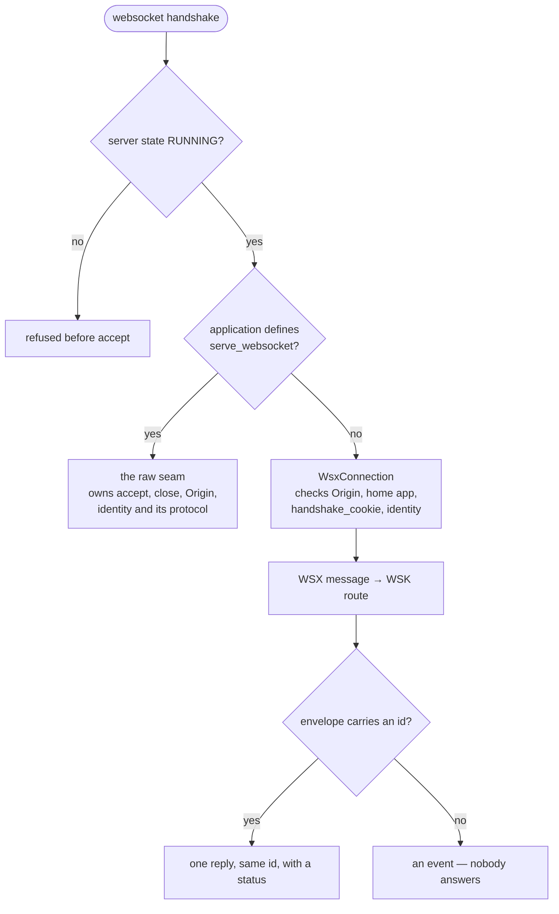

# WebSockets: WSX and raw hosting

The core supports two ways to serve a WebSocket: its WSX message protocol, and
an application's `serve_websocket(scope, receive, send)` raw seam. The
`websockets` backend required by uvicorn is a package dependency.

## At a glance



The HTTP middleware chain runs on neither the handshake nor the messages.

## Sending a WSX request

A WSX frame is text: `WSX://` followed by JSON. Its `data` field is a **TYTX
string**, not a nested JSON object. Use `WsxEnvelope` to encode and decode:

```python
from kajenn.wsx import WsxEnvelope

message = WsxEnvelope(id="request-1", path="/greet", data={"name": "Ada"})
text = message.encode()
assert WsxEnvelope(text).data == {"name": "Ada"}
```

Against the getting-started server, a Python client can make that call.
`AsgiServer` already supplies pydantic parameter validation. Run the client in
a separate process:

```python
import asyncio
from websockets.asyncio.client import connect
from kajenn.wsx import WsxEnvelope


async def main():
    async with connect("ws://127.0.0.1:8000/") as socket:
        await socket.send(WsxEnvelope(id="request-1", path="/greet",
                                      data={"name": "Ada"}).encode())
        reply = WsxEnvelope(await socket.recv())
        assert reply.id == "request-1"
        assert reply.status == 200
        assert reply.data == {"hello": "Ada"}


asyncio.run(main())
```

Every message goes through the server's mount demux and then the application as
a synthetic HTTP scope with method `WSK`, even if its envelope named a method.
A message with an `id` is registered and answered with that id and a status.
An ordinary message without an id is an event and gets no reply. The reserved
`/_wsx/ping` is handled inline and answered outside the concurrency limit.
Non-WSX text and binary frames are logged and dropped.

## Handshake and limits

The handshake path goes through the server's demux to select a home
application. An unknown home, or a missing cookie the application demands
through its `handshake_cookie` property, is accepted and then closed with code
1008, so the client can read why.
A hostile Origin is refused before accept. With no allow-list, a browser's
Origin must match the handshake Host; clients without an Origin header pass.
Configure browser origins explicitly when necessary:

```python
# Inside AsgiConfigBuilder.main:
root.configuration().server().websocket(
    origins="https://app.example.com,https://admin.example.com",
    max_concurrent=16,
)
```

Constructor form: `AsgiServer(websocket={"origins": ["https://app.example.com"],
"max_concurrent": 16})`. The default limit is 16 executing messages per
connection. It does not bound the number of pending tasks or the total memory
queued on that connection. Closing a connection waits up to five seconds for
its message tasks and cancels the remainder.

Identity is authenticated once at the handshake; the existing session is read
without creating one. The identity and session are carried into each message.
The HTTP middleware chain does not run on the handshake or per message.
WSX responses must be finite and buffered: an ASGI response chunk with
`more_body=True` is rejected and the call becomes a 500 response.

## Raw WebSockets

An application defining `serve_websocket` receives the mount-relative scope,
receive and send directly. It owns accept/close, Origin and identity validation,
its protocol, and cleanup; the WSX gate and registry are not used. The server's
not-running admission gate still applies before delegation. See the adapter in
[Mounting applications](applications.md).

## Page channels and server push

The core offers one seam for addressing a single page later: a client sends
`/<mount>/_wsx/openchannel` (omit the mount for a root application) carrying
`page_id` in the envelope. The **application** decides whether that page may
speak on that socket, and only a `200` answer makes the connection bind it in
`WebSocketRegistry`. `_wsx` is the reserved first segment the connection reads
after the mount is stripped; everything else about the exchange belongs to the
application.

```python
delivered = await server.send_message(page_id, path, data)
```

`send_message` writes one message of the server's own — method `WSK`, no `id`,
so nobody answers it — onto the socket the page is bound to. It returns `True`
when the message was written to a socket and `False` when that page speaks on
none or its socket is already closed. **Delivered means written**: nothing waits
for the client to act on it. `send_serialized_message` is the same thing for a
value that is already a `SerializedWsxPayload`.

Nothing here converts application events into push notifications by itself, and
nothing here validates page ownership — that judgment is the application's.
