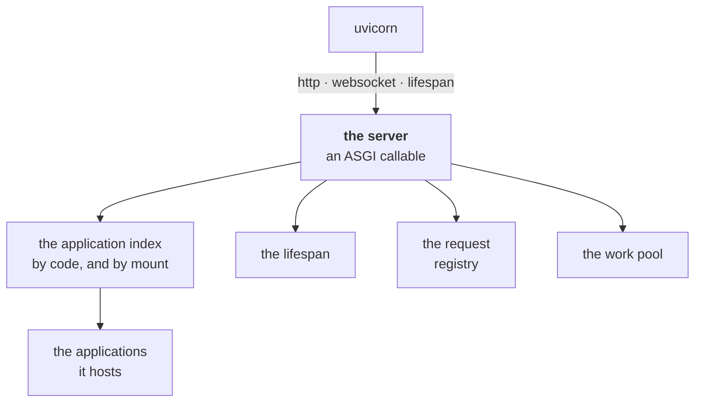
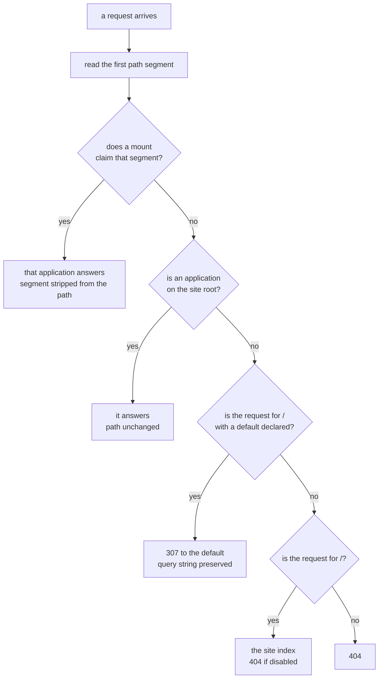

# Server

**Version**: 0.6 · **Last Updated**: 2026-09-08 · **Status**: 🔴 DA REVISIONARE

What a server is, what it is made of, and how a request gets from the
network to the program that answers it.

## What a server is

A server hosts applications, selects the application for each request, and owns
their shared lifecycle, request registry and work pool.

One process can expose several unrelated
things: a shop, an administrative surface, a machine-readable API. They were
written by different people at different times, and each of them was written
as if it owned the whole site.

A **server** is the object that makes that arrangement work. It holds the list
of what is installed, and for every request that arrives it decides which one
of them answers, hands the request over, and stays out of the way. Around that
one decision it also owns the few things the installed programs must share:
when they start and stop, where their blocking code is allowed to run, and the
live picture of what the machine is doing right now.

What it does **not** do is understand any of them. It never looks inside an
application, never knows what a shop is, never learns that one of them is
administrative. That ignorance is the whole design: it is why an application
can be written, replaced or removed without the server changing at all.

The programs it hosts are called **applications**. The word means one precise
thing: something the server can install, address, and hand a request to.

## The anatomy

A server is one object with **four members of its own** and a **list of the
applications it hosts**. Uvicorn — the process that owns the network socket —
drives it through three kinds of traffic.



| The part | In one line |
|---|---|
| the composition | the server is a chain: a lean base, layers above it |
| the applications | what it hosts, and the two things it knows about each |
| the demux | how one request finds its one application |
| the registry | which request am I serving, and what else is in flight |
| the lifespan | who starts first, who stops last |
| the work pool | where blocking code runs so the loop stays free |
| the three scope types | how uvicorn's three kinds of traffic enter |
| the configuration | where the whole shape comes from |

Each of the eight is described on its own below. They are meant to be read in
that order, and each one is closed: nothing in it depends on a page elsewhere.

---

## 1. The composition — a lean base, capabilities above it

A server is not one class. It is a **chain of classes**, assembled from the
bottom.

At the bottom sits the **base server**. It is deliberately small: it hosts
applications, routes each request to one of them, and owns the four members of
the anatomy. Everything else a real installation needs — knowing who the user
is, keeping state between requests, the uniform middleware chain every request
passes through, plugged capabilities, filesystem access, background work, a
channel to a parent process — is **not** in it.

Above the base come the **capability mixins**. Each is a self-contained piece
adding exactly one concern. Each takes its own construction arguments, keeps
what belongs to it and passes the rest down the chain, so a layer is added
without any other layer knowing. The base is always the end of the chain: an
argument nobody claimed is an error naming it, not a value silently dropped.

This is what makes a server come in **usage levels**, each one usable on its
own:

- the **bare base**, when you want to embed a single application and nothing
  else;
- the **public server** — the composition an installation actually runs, with
  authentication, sessions, the middleware chain, plugins, storage and
  background work stacked on. This is the one the recipes at the foot of these
  pages build, and the class is `AsgiServer`;
- the **internal server**, which is never exposed: it is composed *without*
  the authentication layer, so a process that must not be reachable cannot be
  made reachable by a configuration mistake. It is not a flag, it is a
  different composition;
- a **server with a link to a parent armed**, which is the public server with
  one argument different — the same class, so a hierarchy of installations
  needs no fourth composition.

The order of the layers is not decorative: a layer that reads another's work
must sit above it, and a layer that must wrap the server's own start-up must
sit below the ones that don't. The chain is where those relations are stated
once.

---

## 2. The applications it hosts

The server knows exactly **two things** about each application, and both are
declared by the application itself:

- its **code** — the identity. This is the name everything else uses to refer
  to it: the key of the list, the address of its slice of the configuration,
  the label in the monitor.
- its **mount** — the URL prefix it answers under. A mount of `""` is the
  site root: a deliberate value, not a missing one, and the difference
  matters because an application with no mount declared answers under its own
  code.

The two are separate on purpose. The same application class can be installed
twice, under two codes and two mounts, and each installation is its own thing
with its own configuration.

The server keeps them in **two indexes** — one by code, to answer "who is
`admin`?", and one by mount, to answer "who answers under `/admin`?". Both are
written together, always, so they cannot disagree.

Installing an application also establishes **ownership**, and it runs one way:
the application learns which server it belongs to, and belongs to that one
alone. The same instance cannot be served by two servers at once. The server
writes, the application reads.

Everything else an application is — its routes, its handlers, its pages — is
its own business, and the server never inspects it. The only contract it must
satisfy is small — **four requirements**: be callable the way ASGI expects,
carry its identity (`code` + `mount`), accept the ownership assignment, and
answer the two lifecycle calls of the lifespan. Alongside them an application
carries **four declarations** about itself, each with a default that says
*nothing special*. The normative statement of the whole contract, requirements
and declarations, is [020 applications](../020_applications/decisions.md) §1.

The installed set is **not sealed**: which applications are installed is a
fact of the configuration, and it changes while the server runs — the last
block of this page describes how.

Which does not mean the server may do as it likes with them. **An application
declares what may be done to it** — one of the four declarations: one holding
live state — people using it,
pages open, connections held — says whether it can be removed while running and
put back, and saying so means guaranteeing the mechanism that makes it
possible. One that cannot does not claim it can, and its change waits for a
restart. And accepting a change is not finishing it: the change lands
atomically or not at all, while what follows can take time, because an
application with people using it warns them and waits before letting go.

> What an application looks like inside is [020 applications](../020_applications/README.md).

---

## 3. The demux — how a request finds its application

**Demux** is the name of the decision "who answers this request". There is
exactly **one** rule in the entire system, and it reads only the **first
segment of the path**.

1. **The first segment names a mount.** That application answers, and the
   segment is *stripped* from the path it receives. An application mounted at
   `admin` sees `/users` when the browser asked for `/admin/users` — so it can
   be written as if it owned the site, which is what lets the same application
   be installed under two different prefixes.
2. **Otherwise, an application sits on the site root.** It answers, with the
   path unchanged. It is the catch-all: every path no mount claimed reaches
   it.
3. **Otherwise, the request is for `/` and a default was declared.** The
   answer is a **307** redirect to that application. It is 307 and not 301 or
   302 because the method and the body must survive the hop: a `POST /` has to
   arrive still a POST.
4. **Otherwise, the request is for `/`: the site index answers.** The server
   itself serves an HTML page with the kajenn logo and links to the
   mounted applications; codes starting with `_` are excluded from the list.
   A configuration switch disables the index; disabled, `/` is a 404.
5. **Otherwise, 404.** A deep path nothing claimed is always a 404 — the
   index answers `/` and nothing else.



Two things this rule implies are worth stating plainly.

**A site root is optional.** A server can be made of mounts only, with nothing
answering `/`. Then branch 2 never fires, and `/` redirects to the declared
default, or — with no default — serves the site index; with the index disabled
by configuration, it is a 404.

**The default elects nothing.** Naming a default does not make that
application the catch-all. It is a redirect target for `/` and no more: an
unclaimed path is still a 404, and a server that *does* have a site root never
consults the default at all.

Rule 1 also covers `/` on a server that has a root application, with no
special case: `/` has an empty first segment, the root application's mount is
the empty string, so the first branch matches and forwards the same `/`.

---

## 4. The registry — the current request, and the picture

The registry records in-flight requests and exposes the current thin registry
item to dispatch machinery. It does not expose the application’s `Request`
object to handlers.

It answers two questions:

- *which request am I serving right now?* — asked by the server's own
  machinery around the dispatch: a middleware layer, the logging, the
  cleanup at the end of the dispatch. Never by a handler — handlers are pure
  and receive nothing from the environment;
- *what is in flight across the whole server?* — asked from outside, by
  whoever is watching the machine.

The **registry** answers both, and it is the **single writer** of that
picture: the server enters a request when the dispatch begins and removes it
when the dispatch ends, and nobody else writes.

Each entry is one **item** — a deliberately thin record, because there is one
per request and requests are many: an id, the kind of traffic, the path, and
the moment it started. Not the request object itself, not its body, not its
headers. This is why the current request is no ambient request: what the
machinery reads back is the thin item, and the `Request` an application built
stays the application's.

The "current request" is per **task**, not per server: two requests being
served at the same time each see their own, with no locking and no
bookkeeping, because each runs in its own context. The mechanism lives on the
registry instance and not in a module-level global, so it belongs to one
server and disappears with it — two servers in one process do not see each
other's traffic.

The item is also where a request's **end of life** is recorded. Code holding
the current item can leave a callback to be run when the dispatch ends,
whether the handler returned or raised; the server runs them in reverse order
of registration, and one that fails does not stop the others. This is how
something opened in the middle of a request gets closed without the server
ever learning what it was — a database connection closing itself is the plain
case.

---

## 5. The lifespan — who starts first, who stops last

The server runs application startup hooks **in installation order** and
shutdown hooks **in reverse**. Hooks build and release resources such as
connections, schedulers and background loops. The reversal is the point: something built
on top of something else is torn down first, so the layer it depends on is
still alive while it does. A hook may be written as ordinary code or as
asynchronous code, and the server works out which at the moment it calls it.

One rule matters more than the order: **a hook that fails is recorded, and the
sequence continues**. One application's broken start-up never prevents the
others from starting, and the protocol always completes. An application's
error is that application's problem; it never takes the machine down with it.

This is about the hooks, and only about them — the moment when the applications
are already built and mounted and are being told to start. Whether the
installation may boot at all is settled earlier and far more strictly: an
application whose class will not import, or two claiming one prefix, stop the
boot outright. That earlier gate belongs to
[015 configuration](../015_configuration/README.md).

---

## 6. The work pool — where blocking code runs

The server owns one thread pool for blocking work; asynchronous handlers stay
on the event loop. Blocking work must not stop that loop. But plenty of useful code blocks — a database driver, a file read, a
library that was never written for asynchronous use.

So the server owns **one** thread pool, and only blocking work goes to it.
Code written for the loop stays on the loop and never comes near the pool.
Blocking code is handed to the pool through `run_sync`, and the caller's
context travels with it — so code running on a pool thread still sees the
current request, exactly as if it had stayed on the loop.

The pool is built **when it is first needed**, not at start-up: a server that
never runs blocking code never creates a thread. It is torn down at shutdown,
and the teardown leaves it ready to be built again, so a server that is
started and stopped repeatedly keeps working.

Two gauges are published, `total` and `busy`, and the second name is a trap.
`total` is how many slots exist. **`busy` is not how many slots are occupied**:
it counts every call handed to the pool and not yet come back, which past
saturation includes the ones still waiting in a queue — so `busy` can exceed
`total`. That is deliberate, and it is why the name misleads: what the gauge
reports is demand, and a gauge that stopped at the ceiling would hide exactly
the situation you consult it for.

---

## 7. The three scope types — how traffic enters

Uvicorn drives the server with three kinds of traffic, and the server accepts
those three and nothing else.

**HTTP.** The ordinary case. The request is entered in the registry, the demux
picks the application, the application answers. On the way out — always, even
when the handler failed — the request's end-of-life callbacks run and the
entry is removed. A handler that raises is not an exception to this: it is the
reason the guarantee is written that way.

**WebSocket.** The server owns the WSX connection and routes each message to
an application. An application declaring `serve_websocket` receives the raw
ASGI connection instead. Both modes pass the server's state gate before accept;
the raw application then owns its protocol and handshake policy.

> The connection and the message contract are
> [055 WebSocket](../055_websocket/decisions.md).

**Lifespan.** The ordered start-and-stop conversation described above, plus
the teardown of anything the server built for itself while running.

Anything else is a protocol violation and is refused as such. It is not a case
to absorb quietly: nothing else can legitimately arrive.

---

## 8. Where the shape comes from

Everything above describes a server that exists. This block says who decided
it exists, and how it changes.

An installation is described **once**, in a site configuration: which
applications are installed, under which codes and mounts, which one `/`
redirects to, which databases exist, what each capability is set to. The
server **reads itself** from that description — nothing builds a server from
the outside and hands it its parts. A value given explicitly at construction
wins over the configured one, one value at a time, so a configured
installation can be started on a different port without editing anything.

The configuration is not a file read once at boot. It is a **live document**:
a tree that can be read, written, and that notifies whoever is watching it.
That is what makes the installed set changeable while the server runs.
Commands on the administrative surface write into the tree; the write notifies
the server; the server brings the installed set in line with what the tree now
says. Installing an application, removing one, moving one to a different
prefix: each is an operation someone performs on a running machine, not a
reason to restart it.

A change that cannot be honoured is **refused, and refused loudly** — two
applications claiming one code, two claiming one mount, a default naming
something that is not installed. A collision is answered with an error the
administrator reads, never absorbed into a silent misroute that shows up later
as a request arriving in the wrong place. And refusal is atomic: the change
lands, or the description is untouched.

*How* a change is taken on and how the system then comes into line with it is
[015 configuration](../015_configuration/README.md)'s subject, not this page's.

One application is always present without anyone configuring it: the
**administrative application**, which carries the monitor, the login surface,
the system endpoints and the commands described just above. It is there
whether the server was built from a configuration or by hand, so the
administrative surface is never something an installation can forget.

> The tree, its layers and its vocabulary are
> [015 configuration](../015_configuration/README.md); the administrative application
> and its sections are
> [090 server-application](../090_server-application/README.md).

---

## Shared capabilities and application contracts

Everything else in kajenn is one of two things: a **capability mixin**
stacked on the server, or an **application** it hosts. Authentication,
sessions, the middleware chain, storage and background work are the first kind.
The administrative surface and the machine-readable interfaces are the
second, and so is every application that arrives from its own distribution. Both rest on exactly what is described above, and neither
changes any of it.

## A configuration that includes it

A whole installation showing what this page describes: two applications, one of
them the catch-all on the site root, and a sized thread pool.

The language it is written in — a recipe class, the sections, `app_class` — is
the subject of [015 configuration](../015_configuration/README.md) and is explained
there. Read it here for the shape of the result, not for the grammar.

```python
import tempfile

from genro_storage import StorageManager

from kajenn import AsgiServer, RoutedApplication
from kajenn.config import BaseConfiguration


class Shop(RoutedApplication):
    """The catch-all: it answers / and every path no mount claims."""

    mount = ""


class Admin(RoutedApplication):
    """Mounted under /admin, and written as if it owned the site."""


# The local backend refuses a directory that is not there; a real deployment
# names its own.
SITE_DIR = tempfile.mkdtemp(prefix="shop-")


class ServerConfiguration(BaseConfiguration):
    """Two applications, one of them on the site root, and a sized pool."""

    def main(self, root):
        cfg = root.configuration()
        cfg.server(host="127.0.0.1", port=8000, max_threads=8)
        self.storage_section(cfg)
        apps = cfg.applications()
        apps.application(code="shop", app_class=Shop, mount="")
        apps.application(code="admin", app_class=Admin)

    def storage_section(self, cfg):
        cfg.storage(app=StorageManager).local(name="site", base_path=SITE_DIR)


server = AsgiServer(config=ServerConfiguration)
```

Asked who answers what, that installation gives the four branches of the demux:

| Path asked | Application | Path it receives |
|---|---|---|
| `/` | `shop` | `/` |
| `/catalogue` | `shop` — the catch-all | `/catalogue` |
| `/admin/users` | `admin` | `/users` — the segment stripped |
| `/admin` | `admin` | `/` |

The third row is the one to notice: `admin` never sees the prefix it is mounted
under, which is why the same class can be installed twice somewhere else.

And `server.pool.metrics` answers `{'total': 0, 'busy': 0}` — the pool has not
been built, because no blocking handler has run yet.
