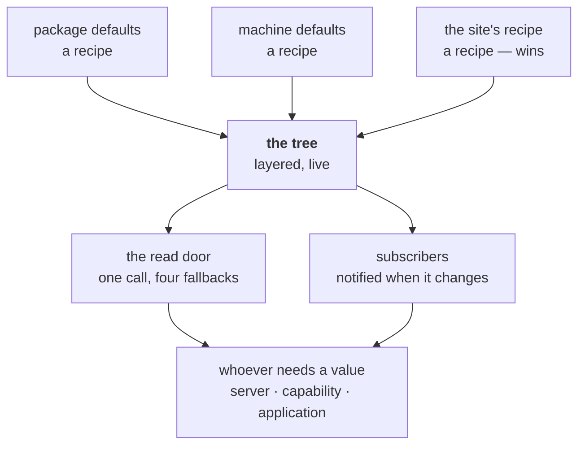

# Configuration

**Version**: 0.4 · **Last Updated**: 2026-09-08 · **Status**: 🔴 DA REVISIONARE

How an installation is described, how the description is read while it runs,
and how each part of the system contributes its own words to it.

## What a configuration is

A configuration describes an installation through a declared grammar. The
software reads that description to assemble its applications and shared
services.

Two deployments of the same software are not the same installation. One serves
a shop on port 8000 with a single database; the other serves the shop and an
administrative surface behind a proxy, with three storage volumes, an identity
provider and a pool of worker processes. Nothing about that difference belongs
in the code — the code is identical in both.

So an installation is **described**, once, in one place. That description names
which applications are installed and where, which databases exist, where files
live, who is allowed in and how, and how much of the machine the server may
use. Given the description, the software assembles itself.

Three properties make the description more than a settings file, and they are
what this page is about.

**It is a document with a grammar, not a bag of keys.** Every word in it is
declared by the part of the system that consumes it, and a word nobody declared
is refused when the description is read — not later, when the value would have
been used.

**It is layered.** The same description is written at three levels — what the
package ships, what a machine adds, what a site says — and the site wins. So a
deployment declares only its differences.

**It is alive.** The description is not read once at boot and discarded. It
stays as a tree the running system watches, and changing the tree changes the
installation.

## The anatomy

A configuration exists in two forms, and keeping them apart is the whole of
understanding it.

The form you **write** is a **recipe**: a Python class with one method, calling
the grammar to build the document. The form the system **reads** is a **tree**:
what the recipe produced, layered with the recipes under it, watched by whoever
cares.



| The part | In one line |
|---|---|
| the recipe | what you write: a class, one method, calls into a grammar |
| the grammar | which words exist, declared by whoever consumes them |
| the three layers | package, machine, site — the site wins, per value |
| the read door | one call answers any address, falling back four times |
| the live tree | it can be written while running, and it notifies |
| the sections | what the server itself declares |

---

## 1. The recipe — a description you execute

A configuration is not a data file. It is a **class** — a subclass of
`AsgiConfigBuilder`, the dialect that carries the grammar; the recipes in this
dossier subclass `BaseConfiguration`, which is that class with the package's own
defaults already written into it (§3). Describing an installation means writing
one method:

```python
from kajenn.config import AsgiConfigBuilder
from myshop.app import Application as Shop

class ServerConfiguration(AsgiConfigBuilder):
    def main(self, root):
        cfg = root.configuration()
        cfg.server(host="127.0.0.1", port=8000)
        cfg.applications(default="shop").application(code="shop", app_class=Shop)
```

Each call builds one node of the document. The method names are not free text:
they are the **grammar**, and calling one that does not exist, or putting it
where it may not go, fails while the recipe runs.

Being code rather than data buys two things that matter. An application class
is **passed as the class itself**, imported at the top of the recipe — so a
typo in an application name is an import error at boot, not a lookup failure
later. And a description that is getting long is split into methods, one per
section, each small enough to read at a glance.

What a recipe must never contain is a **secret**. A password or a key is
written as a **resolver** — an object that fetches the value when it is read,
from the environment or elsewhere — and it is placed exactly where the literal
would have gone. Some words refuse a literal outright: the bootstrap
administrator password is declared in a way that rejects one at the recipe
line, because a secret in a recipe is a secret in version control.

## 2. The grammar — every part declares its own words

Nobody owns the whole vocabulary. **Each part of the system declares the words
it consumes**, and the description is validated against the union.

The server declares the sections of the top level. A capability that owns a
subject declares the words of that subject and attaches them where they belong
— the task backbone declares its own child of the server section. And an
application declares its own vocabulary entirely: the site's grammar does not
know it and does not validate it.

That last one is the interesting case, because it is how the description stays
open without becoming untyped. When a recipe declares an application, it hands
over **the application class**, and that class carries its grammar. From that
node down, the words are the application's own — the site dialect steps aside
and lets the application's grammar govern its own children. So an application
that runs a pool declares that pool and its groups in its own words, under its
own entry, and the server never learned what a pool is.

The consequence for anyone adding a feature: **a new capability or application
brings its own words with it**, declared next to the code that reads them.
Nothing central has to be edited, and nothing central has to know.

## 3. The three layers — package, machine, site

The same installation is described at three levels, and they stack:

1. **What the package ships.** Defaults written as a recipe like any other, not
   as fallbacks scattered through constructors — so they are readable in the
   same language, and a site can override them one value at a time.
2. **What the machine adds.** The layer a system administrator owns: a volume
   that exists only on this host, where the key material comes from, the
   listener. Set once, inherited by every installation deployed there.
3. **What the site says.** Always last, always winning.

### BaseConfiguration defaults hooks

`BaseConfiguration` exposes `server_section`, `storage_section` and
`storage_mounts` hooks. Its inherited `storage_section` calls `storage_mounts`;
a site overrides the hook whose defaults it wants to replace.

A recipe governs its own inheritance: it declares where its middle layer comes
from, and it may decline it entirely and sit straight on the package defaults.
An explicit choice the system cannot honour — a defaults file that is named and
missing — is a configuration error, never a silent skip.

The layering is done on the **tree**, not on the classes: each recipe is
executed and the results are folded, lowest first. So a site that subclasses
the package defaults and a site that subclasses the plain dialect inherit the
same thing — the layering belongs to the reading, not to the class hierarchy.

## 4. The read door — asking for a value

Nothing hands a component its slice of the description. **Whoever needs a value
asks for it, by address.**

An address is the names you cross to reach the value. `server.host` means: the
`host` written on the `server` section.

The useful part is that **you can work out an address without opening the
recipe**, because an address has only two kinds of segment.

**Names the grammar fixes.** There are eight sections and no more, and each may
be written only once, so a section's name IS its address. This recipe line

```python
cfg.server(host="127.0.0.1", port=8000)
```

puts that host at `server.host`. There is nothing to look up, and there is no
`server_1` to discover, because a second `server` section is refused.

**Names you choose yourself.** Applications and identity providers come in
several, so `application` cannot name three different nodes. For those the
grammar uses the `code` written by whoever wrote the recipe. These two lines

```python
apps.application(code="shop", app_class=Shop)
apps.application(code="admin", app_class=Admin)
```

put those applications at `applications.shop` and `applications.admin`.

So every address is either fixed by the grammar or chosen by the author, and a
caller is never guessing:

```python
self.server.config("server.host")
self.server.config("authentication.credentials.jwt_0.algorithm")
self.config("parameters.title", default="Shop")   # from inside an application
```

### Four fallbacks, in order

An address that is asked for is answered by the first of these that has
something to say:

1. **the written value** — what the recipe wrote. A resolver sitting there is
   resolved at this moment, so a value that comes from the environment is read
   when it is asked for, not frozen when the recipe ran;
2. **the declared default** — the default of the word in the grammar, read now
   rather than baked in, so the document stays a record of what was *written*;
3. **the caller's own default** — supplied at the call site;
4. **a noisy error** naming the path that was asked for.

A component never holds a copy of its subtree; it holds an **address in it**.
An application asks with paths relative to itself and the door prefixes them,
so an application can only read its own words, and two installations of the
same class read different values without either knowing.

## 5. The live tree — writing it, and converging to it

The tree the system reads is a **live document**: it can be read, it can be
written, and it tells whoever asked to be told.

**At boot the rule is strict.** A description that is grammatically wrong does
not run — and one that is grammatically right but cannot be carried out does
not run either: a prefix claimed twice, an application class that will not
import. The installation is described wrongly, and the moment to say so is
before the first request. The one exception is declared by the part itself: an
application may say that a failure of its own is survivable, and then the
server starts without it — one of the four declarations of the application
contract ([020 applications](../020_applications/decisions.md) §1).

**While it runs, a change has two phases.**

**It is accepted** — atomically. The words are validated, the change is
attempted, and the attempt encloses the notification: if anything refuses, the
description is not changed at all. Notice what is *not* required here: nobody
computes in advance whether every part can comply. **The attempt is the check**,
which is what lets each part keep the knowledge only it has.

**Then the system converges** — and that is not a transaction. Once a change is
accepted the tree holds the state that is **wanted**, and each part brings
itself into line at its own pace and by its own procedure. Something holding
nothing swaps at once. Something holding live state does what its nature
requires: warning the people using it, waiting for them to finish, letting go
only then. That can take minutes, so a change reports itself as **accepted and
in progress**, never as instantly done.

So an administrator is never told "refused" while something was in fact taken
away. Either nothing happened, or something is happening in the open.

**Whoever declares a thing changeable guarantees the mechanism.** Being
removable while running means being able to be put back; a part that cannot do
that does not claim it can. This is why the promise above is honest rather than
aspirational — only what is reversible takes part in it.

**And the capability is foreseen everywhere, guaranteed nowhere in advance.**
Whether a particular word can be changed while running depends on what reads it
and how much state that reader holds, which only that reader knows. So the
answer is declared where the word is declared, and the parts collaborate to
carry the change — there is no central engine that knows how to change
everything.

## 6. The server's own sections

Everything above is mechanism. This is the vocabulary the **server itself**
declares — the words that are nobody else's.

There are eight sections and no more. Each is written at most once, which is
what makes its name usable as its address (§4).

**`server`** — the runtime itself. `host` and `port` are the **listener**:
where to bind. `external_url` is the **public address**: what the server calls
itself when it hands its own URL to somebody else. The two differ behind a
proxy and answer different questions, which is why the public one is declared
rather than guessed from an incoming request — it must match what a third party
was told, and a value derived from a client's own header would be a value that
party rejects. `max_threads` sizes the pool where blocking work runs.
`shutdown_timeout_seconds` (5.0) bounds how long uvicorn waits for open
connections at shutdown before cancelling them: without the bound one endless
response — an SSE stream a client never closes — holds the process for ever and
the lifespan shutdown, which stops the applications, never runs.

Three children are server-domain and so live here rather than under an
application: **`session`**, which carries how long a session lives;
**`tasks`**, whose words belong to the task backbone and are declared by it;
and **`websocket`**, which declares allowed origins and per-connection
concurrency.

The remaining sections are named here and described where they belong:
`middleware`, `authentication`, `storage`, `applications`, `databases`,
`plugins`, `openapi`.

One is worth a line because its shape recurs: **`storage`** declares no
vocabulary of its own. It is a mount point, exactly like an application's:
whoever manages volumes carries the grammar, the mounts are written in that
grammar's words, and this dialect steps aside.

## A configuration that includes it

A whole installation described once: the server's own section, a site recipe
inheriting the package defaults, an encrypted volume, and the secret kept out
of the recipe by a resolver.

```python
import os
import tempfile

from genro_bag.resolvers import EnvResolver
from genro_storage import StorageManager

from kajenn import AsgiServer, RoutedApplication
from kajenn.config import BaseConfiguration


class Shop(RoutedApplication):
    """The hosted application — here a bare one, so the recipe stands alone."""


# A real deployment names its own directory (/srv/shop); the backend refuses a
# path that does not exist, so the example creates one.
SITE_DIR = tempfile.mkdtemp(prefix="shop-")


class ServerConfiguration(BaseConfiguration):
    """One shop on the site root, behind a proxy, with an encrypted volume."""

    def main(self, root):
        cfg = root.configuration()
        self.server_section(cfg)
        self.storage_section(cfg)
        cfg.applications().application(code="shop", mount="", app_class=Shop)

    def server_section(self, cfg):
        cfg.server(
            host="0.0.0.0",
            port=8000,
            external_url="https://shop.example.com",
            max_threads=16,
        ).session(ttl=3600)

    def storage_section(self, cfg):
        section = cfg.storage(
            app=StorageManager,
            storage_key=EnvResolver("GENRO_STORAGE_KEY"),
        )
        section.local(name="site", base_path=SITE_DIR)


# Omitting storage_key leaves encryption unconfigured; an empty resolver is
# different: it promised key material and failed to supply it.
# The resolver reads the environment when the value is asked for. In a real
# deployment the key comes from the host; here it is a throwaway so the recipe
# runs as written. Resolving to empty is a boot error, not a silent skip.
os.environ.setdefault("GENRO_STORAGE_KEY", "S6z15YMHEgMl9Y_AoSPK837uCFSLKPymuGclKZxO4ig=")

server = AsgiServer(config=ServerConfiguration)
```

Read back through the door, that installation answers:

| Asked | Answer |
|---|---|
| `server.config("server.external_url")` | `https://shop.example.com` |
| `server.config("server.port")` | `8000` |
| `server.config("server.session.ttl")` | `3600` |
| `server.applications["shop"].mount` | `''` — the site root |
| `sorted(server.applications)` | `['_server', 'shop']` |

The last row is worth noticing: the recipe declared one application and the
installation has two. The administrative application is there without anyone
asking for it.
