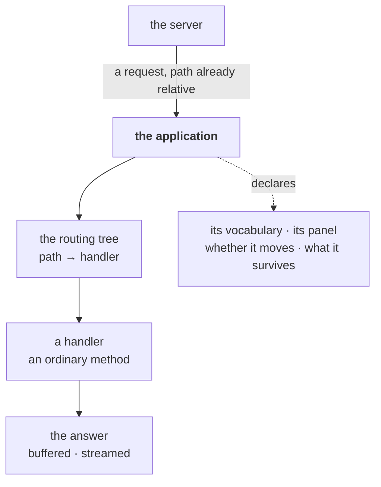
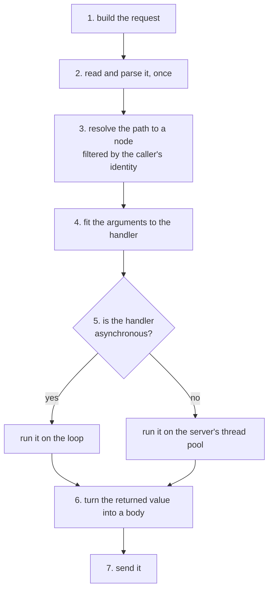

# Applications

**Version**: 0.3 · **Last Updated**: 2026-09-08 · **Status**: 🔴 DA REVISIONARE

What an application is, what it owes the server that hosts it, and everything
that happens between a request arriving at the application and an answer going
back on the wire.

## What an application is

The server holds a list of programs and hands each request to one of them. It
never looks inside. An **application** is what sits on the other side of that
handover: the thing that receives a request the server has already decided is
its own, and produces the answer.

Written from the inside, an application is a **class you subclass**. Its
handlers are its methods. Its address is a class attribute. Its configuration
words are its own. Nothing about it is registered in a central table, and
nothing about it is known to the server beyond the small contract below.

There are two classes to subclass, and almost everybody wants the second.
`BaseApplication` is the contract and nothing else: it satisfies the server
and answers requests however it likes, which suits something that is not a
site at all — a raw proxy, a single endpoint. `RoutedApplication` adds the
routing tree, dispatch and response handling.

That is what makes an application portable. The same class can be installed
twice on one server under two names, or moved to another server entirely, and
neither the class nor the server needs editing. It can also be written by
someone who has never read the server's code — which is the actual test, and
the reason the contract is kept as small as it is.

Two applications exist in every installation without anyone writing them: the
administrative one the server mounts by itself, and — where a site is hosted —
the front that serves it. Both are ordinary applications by these rules, and
both are described elsewhere.

## The anatomy

An application meets the server on a **contract of two halves** and, inside,
holds **one routing tree** through which every request travels. The tree turns a
path into a method call; the request and the answer are the two objects that
travel with it.



| The part | In one line |
|---|---|
| the contract | four things the server requires, four an application declares |
| a routing class | an application's marked methods are its addressable behaviour |
| the dispatch | the seven steps between the handover and the answer |
| the request | what a handler is given |
| the answer | what a handler returns, and how it becomes bytes |
| the long answer | when the body does not fit in memory |
| the failures | the four ways a request does not reach its handler |
| the faces | one tree, several protocols reading it |

Each is described on its own below, in that order. A block ends with a pointer
where a neighbouring subject is owned by another page; following the pointer is
never needed to finish the block.

---

## 1. The contract — what the server requires, what an application declares

The contract has two halves, and keeping them apart is what keeps it small.

**Four things the server requires.** These are about the handover, and the
server relies on all four for every application it hosts.

**Be callable the ASGI way.** The server hands over the three ASGI arguments
and expects the answer to go out through them. This is the only obligation
with no default, and the only one whose absence shows late: a class that does
not implement it installs and mounts like any other, and fails when its first
request arrives, with an error naming the class.

**Carry an identity and a placement.** A `code` that names it and a `mount`
that places it, both class attributes a subclass sets declaratively and a
constructor argument overrides per installation. They are the server's
subject, not this page's.

**Accept an owner, once.** When the server installs an application it tells it
so, and the application records it. The direction is one way: the server
writes, the application reads. An application already owned refuses a second
owner rather than quietly changing hands, because an instance serving two
servers would have one identity and two contexts.

**Answer the two lifecycle calls.** One at start-up, one at shutdown, either
of them ordinary or asynchronous code — the server works out which when it
calls. Both do nothing by default, so an application with nothing to build
says nothing.

**Four things an application declares about itself.** These are not
requirements: each has a default that says *nothing special*, and an
application speaks only where it has something to say. What makes them a
contract rather than a set of options is that the rest of the system reads
them without ever knowing which application it is reading.

**Its own vocabulary.** A grammar class carried as the class attribute
`grammar`, which the site recipe mounts at the line that installs the
application. From that point down the words are the application's own. It
reads them back by address relative to itself, so two installations of one
class read two different sets and neither knows the other exists.

The vocabulary every application inherits has one word, `parameters`, for free
options — enough that an application needs to declare nothing. One with words
of its own subclasses it and adds them:

```python
from genro_builders.builder import element
from kajenn.application import ApplicationGrammar


class ShopGrammar(ApplicationGrammar):

    @element(node_label="branding")
    def branding(self, title: str = "", currency: str = "EUR") -> None:
        """Written in the recipe as .branding(title=…), read as branding.title."""


class Shop(RoutedApplication):
    grammar = ShopGrammar
```

A parameter's own default is part of the declaration, so a recipe that writes
only the title still reads `EUR` back from `branding.currency`.

**Who draws it.** The administrative monitor renders every installed
application without knowing any of them by name: it asks each one for a
snapshot of itself and for the name of the panel that draws it. An application
that says nothing gets identity facts and a generic panel, which is why a new
application appears in the monitor the day it is installed without the monitor
being touched.

**Whether it can be moved while it runs.** Which applications are installed is
a fact of the configuration, and the configuration changes while the server
runs. An application holding live state — people using it, pages open — says
whether it can be taken away and put back, and **saying so means guaranteeing
the mechanism that makes it possible**. One that cannot does not claim it can,
and its change waits for a restart.

**Whether its own failure is survivable.** An application whose mount fails at
boot normally stops the boot, because an installation described wrongly should
say so before the first request. An application may declare its own absence
tolerable instead, and then the server starts without it. The application
decides what may be survived, never the server.

> The tree the vocabulary lives in is
> [015 configuration](../015_configuration/README.md); the monitor and its panels are
> [090 server-application](../090_server-application/README.md); when a change is taken
> on and what follows is
> [015 configuration](../015_configuration/README.md) again.

---

## 2. An application is a routing class

The class you subclass is two things at once. Toward the server it is an
application with its identity and lifecycle contract. Toward its own insides it is a
**routing class**: a class whose marked methods *are* its addressable
behaviour.

```python
class Shop(RoutedApplication):

    @route()
    def home(self): ...                    # answers /home

    @route()
    async def whoami(self): ...            # answers /whoami — asynchronous, same rule

    @route(auth_rule="admin")
    def takings(self): ...                 # answers /takings, to admins only
```

There is no table of paths, no registration call, and no separate file to keep
in step with the code. A method marked as a route becomes a node named after
the method, and the class's routes together form its **routing tree**.

That inheritance is the reason this page can be short about routing. Everything
an application does with paths — how a tree is built and walked, how a
separately written class is attached below a name, what filters a caller's
identity applies to the walk, and what a plugin is — belongs to the routing
system, and an application gets all of it by being a routing class rather than
by implementing any of it.

Two facts from there are used by the blocks that follow, and are stated here so
those blocks read on their own. **A route may carry options beside it**, like
the `auth_rule` above, which nothing in the handler body reads. And **every
tree can describe itself** — its routes, their declared parameters, the options
beside them — the metadata used by OpenAPI and MCP.

> The routing system is [025 routing system](../025_routing-system/README.md).

**A tree belongs to one application.** Nothing outside reaches in to add a
route to somebody else's tree — a rule with a history: a system endpoint
injected into a hosted application's router is how two programs end up sharing
one namespace and colliding over it.

---

## 3. The dispatch — from the handover to the answer

The handover gives the application three things: the ASGI description of the
request, the channel to read the body from, and the channel to write the
answer to. The path in that description is **already relative** — the server
stripped the prefix the application is mounted under, so an application never
sees where it was mounted and can be mounted anywhere.

Seven steps follow, in order.



**Steps 1 and 2** produce the request object described in the next block. The
reading happens once, at the start, and everything downstream reads the result
rather than the wire.

**Step 3** is where authorization happens, and it happens as part of finding
the handler rather than after finding it. The caller's identity arrives as a
set of tags — put on the request by the layer that resolved who is calling —
and the tree matches the path only against nodes those tags open. A node the
caller may not have is therefore never called: the refusal comes from the
resolution, not from a check the handler was trusted to write.

A caller who presents no identity supplies **no tags**, which is the strictest
case and not the loosest. Every route carrying a rule is closed to them,
because no tag they hold can match one. What they reach is exactly the routes
that carry no rule at all — which is the definition of public.

Tags are one of three filters the resolution accepts, and the only one an
ordinary application uses. The other two — what this installation is able to
do, and which channel the request came in through — belong to the routing
system with the rest of the walk.

> Who resolves the identity and puts it there is
> [050 authentication](../050_authentication/README.md); the three filters are
> [025 routing system](../025_routing-system/README.md).

**Step 4** fits the values that arrived to the parameters the handler
declares. A handler is an ordinary method with ordinary parameters, and it is
called with ordinary arguments — a query value, a field of a submitted
document — so writing one requires knowing nothing about HTTP. The
reconciliation is described with the request, below.

**Step 5** is the one rule an event loop has. A handler written as
asynchronous code runs on the loop. A handler written as ordinary code would
block the loop, so it runs on the server's thread pool instead, and the
application never chooses: the vehicle follows the handler's own nature, read
from the tree. A synchronous handler gets one thing more — a hook that runs on
the same pool thread immediately after it, whether it returned or raised, for
releasing whatever the handler opened that must be released on the thread that
opened it. Asynchronous handlers have no such hook and need none.

**Steps 6 and 7** are the answer, described two blocks below.

The dispatch owns none of the request's end of life. Whatever was opened
during it is closed by the server, after the answer has gone out.

---

## 4. The request — what a handler is given

Handlers are **pure**: nothing ambient tells one which request is being
served. What a handler needs, it declares as a parameter and receives as an
argument. This is the difference between a handler you can call from a test
with three values and a handler that only runs inside a server.

### Request body parsing

One object holds the request. It is built once and parsed once:
headers, cookies, the query string and the body are read at the start, and
everything after that reads the result. The body is **hydrated by
content-type** — a submitted JSON, XML or msgpack document arrives as values,
not as bytes, and a form arrives as typed fields.

### Request identifiers: x-request-id and x-external-id

Two identifiers ride along, and they are kept apart on purpose. The **request
id** is this machine's own handle on the request: it is taken from the
`x-request-id` header when the caller sends one and generated otherwise, so one
line in a log can be followed across the whole machine. The **external id** is
the caller's own reference, sent as `x-external-id` and carried untouched, so a
client can find its own request in an answer without either side overwriting
the other's identifier.

The request also carries what the layers above it resolved: who is acting
(an identity, or nobody), the session if there is one, and the database handle
for the application, prepared on first use and closed at the end of the
request without the handler doing anything about it.

### Body argument binding: body_data and body_raw

 The values that arrive are a query string
and possibly a body, and the shapes differ: a query is already a set of named
values, while a submitted JSON document is one value that happens to be a
mapping. A handler declaring `x` and `y` is written for the first shape. So
when the handler declares plain parameters and a document arrives, the
document's fields are spread over them, and fields the handler does not
declare are dropped.

A handler that wants the document whole asks for it by name: a parameter
called **`body_data`** receives the hydrated document unspread, and so does a
handler that accepts `**kwargs`. Bytes nobody could hydrate arrive the same
way, under **`body_raw`**.

The decision reads the parameters the handler actually declares, never the
wire format, which is why the same handler serves a form, a JSON document and
a call from a machine-readable interface unchanged.

### Typed request and response transport

 A caller may ask for a typed transport
by header — the same serialization the framework uses between its own
processes. The request records it, and the answer goes back in it. A caller
that asks nothing gets JSON.

---

## 5. The answer — from a returned value to bytes

A handler returns an ordinary Python value and the value becomes the body.
There is **one response class**, not a family: no JSON response, no HTML
response, no file response to choose between. The type of what was returned
decides.

| The handler returns | The body is | The declared type |
|---|---|---|
| a mapping or a list | JSON, or the caller's typed transport | `application/json`, or that transport's |
| a filesystem path | the file's bytes | `application/octet-stream` |
| bytes | those bytes | `application/octet-stream` |
| a string | the text | `text/plain` |
| nothing | empty | `text/plain` |
| anything else | its `str` | `text/plain` |

The last row is the fallback and it never fails: a handler returning a number
or a date answers with its text rather than with an error.

A handler that needs a different declared type says so **at the route**, as
`@route(media_type="text/html")`, so the declaration travels with the node
instead of being written into the handler body. A handler that decides at run
time returns `self.result_wrapper(value, media_type=…)` instead, which carries
the same information alongside the value.

The answer is **buffered**: it is assembled in memory and goes out as one
message with its length known. That is what makes it simple to work with, and
it is the right shape for the overwhelming majority of answers. It is the
wrong shape for exactly two: an answer too large to hold, and an answer whose
end is not known when it begins. Those are the next block.

Headers and cookies are set on the answer before it goes. Setting a cookie is
one call with the attributes named, so the policy — how long, which paths,
whether script may read it — is stated rather than assembled by hand into a
string.

---

## 6. The long answer — streaming, and events

A **stream** is a different shape from a buffered answer, so it is a different
object rather than an option on the same one. What it is given is an
asynchronous source of byte chunks; what it does is frame that source onto the
wire, one message per chunk, and close the stream at the end — including when
the source produced nothing at all. It has no notion of turning a returned
value into bytes, and needs none: whoever writes a stream is already producing
bytes.

A handler answers with a stream simply by returning one, and the dispatch
recognises it and steps aside: nothing is buffered, and the handler speaks the
wire itself.

On top of streaming sits **server-sent events**, the plain way for a server to
push to a browser over one ordinary HTTP connection. An event is a **dict with
three keys, two of them optional**: `data` — the payload, JSON-encoded when it
is not already a string — and `event` and `id`. It is framed into the text
format browsers already understand, so the page reading it is a few lines of
standard code with no library.

A handler writes its source as an ordinary async generator, wraps it in an
`SseStream`, and returns that stream's `response()` — the streaming answer
above with the event-stream headers already on it:

```python
from kajenn.sse import SseStream


class Dashboard(RoutedApplication):

    async def takings_events(self):
        while True:
            yield {"event": "takings", "data": {"today": await self.total()}}

    @route()
    async def stream(self):
        return SseStream(self.takings_events(), retry_ms=2000).response()
```

Two details make it survive real networks. A silent source gets a **comment
sent periodically** to keep the connection from being closed by whatever sits
in between; the browser ignores it, and its only job is to prove the
connection is alive. And when the **browser goes away**, the source is told:
the pending read is cancelled and awaited, so a source that holds a
subscription gets to release it instead of leaking one per closed tab.

The framing takes any asynchronous source of events and knows nothing about
where they come from. Resuming an interrupted stream from the last event
received belongs to whoever owns the source, because only that owner can say
what "the events since" means.

---

## 7. The failures — four ways a request does not reach its handler

A request that does not reach a handler produces one of four answers. All four
are settled **before the handler's own body runs** — the first three while the
path is being resolved, the fourth a step later, while the arguments are being
fitted.

| What happened | Settled at | The answer |
|---|---|---|
| no node at that path, or the node is unavailable | resolution | **404** |
| the node is protected and nobody was presented | resolution | **401** |
| the node is protected and the caller's tags do not match | resolution | **403** |
| the handler exists but the arguments do not fit it | argument fitting | **400** |

The distinction between the middle two is the whole point of having both. To
somebody the server does not know, the answer is *identify yourself*, and a
browser that gets it lands on a login page. To somebody the server does know,
the answer is *not you*, and offering a login form would be a lie.

The last row is worth stating because the alternative is common and wrong: a
caller sending a value the handler cannot accept has made a bad request, and
that is a 400 rather than a crash. It arrives as one kind of failure whether
the value was of the wrong type or under a name the handler does not declare,
because the tree funnels both into a single outcome instead of asking the
dispatch to recognise which validation library raised what.

None of these four is turned into an answer here. They are **raised**, and the
uniform middleware chain around the dispatch turns them into responses — which
is what lets a handler raise one deliberately, from anywhere in its own code,
and get exactly the same answer.

A failure that is none of these four is not a wrong request but a broken
program: whatever escapes the handler reaches the same middleware chain, which
answers 500 and logs it.

The line between the two matters in both directions, and the four answers
above exist to hold it. A caller's mistake must never be reported as a 500 —
they would retry an identical request forever. And a defect of ours must never
be reported as a 400 — the caller would go looking for a mistake they did not
make, while the message that would have named ours goes only to them.

> The middleware chain is [030 middleware](../030_middleware/README.md).

---

## 8. The faces — one tree, several protocols

Everything above describes one routing tree serving HTTP. The same tree serves
other protocols, and that is the reason the parts above are arranged as they
are: resolution, argument fitting and execution know nothing about HTTP, so a
second protocol reuses them rather than reimplementing them.

Two are built. One publishes the tree as a documented REST interface, with a
machine-readable description generated from the handlers' own declared
parameters and a browsable page over it. The other publishes the same tree as
a set of tools a model can call. Neither is a different kind of application:
each is a subclass reading the same tree through a different lens, and a
handler is written once.

> [openapi](openapi/README.md) · [mcp](mcp/README.md)

---

## Shared capabilities and application contracts

Every program a server hosts is one of these. The administrative surface, the
machine-readable interfaces and the front that serves a hosted site are all
applications by exactly the contract above, and each of them adds only what is
its own.

## A configuration that includes it

One class installed twice, each installation reading its own words, with an
externally written routing class attached as a sub-tree.

The recipe subclasses `BaseConfiguration`, which is the package's own defaults
written as a recipe. Three of its methods are the hooks a site overrides:
`server_section` and `storage_section` write those two sections, and
`storage_section` calls `storage_mounts` for the layout. Calling a hook keeps
the default; overriding one replaces it. That is why `main` below calls two
methods it does not define, and defines a third nothing here appears to call.

```python
import tempfile

from genro_routes import RoutingClass, route

from kajenn import AsgiServer, RoutedApplication
from kajenn.config import BaseConfiguration


class Catalogue(RoutingClass):
    """Written on its own, attached below — it knows no application."""

    @route()
    def search(self, q: str = "") -> dict[str, str]:
        return {"found": q}


class Shop(RoutedApplication):
    """Handlers are methods; the app reads the words written under its own code."""

    mount = ""

    def __init__(self, **kwargs):
        super().__init__(**kwargs)
        self.route.add_branches({"name": "catalogue", "instance": Catalogue()})

    @route()
    def home(self) -> dict[str, str]:
        return {"title": self.config("parameters.title")}

    @route()
    async def whoami(self) -> dict[str, str]:
        return {"code": self.code, "mount": self.mount}


# The local storage backend refuses a directory that is not there; a real
# deployment names its own.
SITE_DIR = tempfile.mkdtemp(prefix="shop-")


class ServerConfiguration(BaseConfiguration):
    """The same class twice: the site root, and an outlet under /outlet."""

    def main(self, root):
        cfg = root.configuration()
        self.server_section(cfg)
        self.storage_section(cfg)
        apps = cfg.applications()
        apps.application(code="shop", app_class=Shop).parameters(title="Main Store")
        apps.application(code="outlet", app_class=Shop, mount="outlet").parameters(
            title="Outlet"
        )

    def storage_mounts(self, section):
        section.local(name="site", base_path=SITE_DIR)


server = AsgiServer(config=ServerConfiguration)
```

Asked for each of these paths, that installation answers:

| Path asked | Status | Body |
|---|---|---|
| `/` | 404 | — |
| `/home` | 200 | `{"title": "Main Store"}` |
| `/whoami` | 200 | `{"code": "shop", "mount": ""}` |
| `/catalogue/search?q=lamp` | 200 | `{"found": "lamp"}` |
| `/outlet/home` | 200 | `{"title": "Outlet"}` |
| `/outlet/whoami` | 200 | `{"code": "outlet", "mount": "outlet"}` |
| `/nope` | 404 | — |

Four rows are worth reading twice. `/home` and `/outlet/home` are the same
method on the same class, answering differently because each installation reads
the words written under its own code. `/outlet/whoami` proves the handler sees
`/whoami`: the prefix never reaches the application. And `/catalogue/search`
is served by a class written knowing nothing about `Shop`, attached below a
name — the routing system's business, shown here only because an application
assembled from parts is the ordinary case.

The first row is the one that surprises. `Shop` is the site root, so every
unclaimed path reaches it — including `/`, which arrives as `/` and finds no
route of that name. Being the catch-all makes an application reachable; it does
not give it a home page. One is written like any other route.
