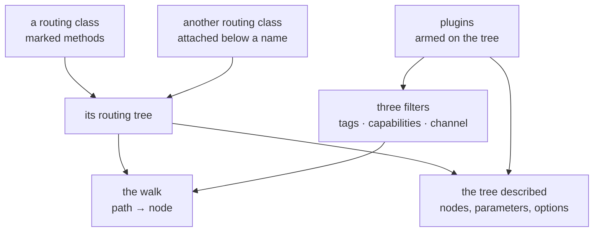

# Routing system

**Version**: 0.5 · **Last Updated**: 2026-09-08 · **Status**: 🔴 DA REVISIONARE

How a path becomes a method call: what a routing class is, how a tree is walked
and filtered, and how a capability is added to what a tree does without editing
the tree, its handlers, or the server.

## What a routing class is

An application is a class whose marked methods are its addressable behaviour.
That property is not the application's own — it comes from being a **routing
class**, and everything in this page is what a routing class brings with it.

A routing class turns a class into a tree. It does it by reading the class
rather than by being told: a method carrying the route marker becomes a node
named after the method, and the nodes together are the class's **routing tree**.
Nothing is registered anywhere, and there is no list of paths to keep in step
with the code.

Three things follow, and they are the three halves of this page — the walk, the
filters, and the plugins.

**A tree can be assembled from parts.** A routing class written on its own, by
somebody who never heard of the application it will end up in, is attached
below a name and its routes hang there.

**A walk can be filtered.** Resolving a path is not only *does this node
exist*: it is *does this node exist for this caller, on this installation,
through this channel*. Three independent filters answer those, and a node the
walk excludes is not reached at all.

**A tree can be read as well as walked.** It can describe itself — its nodes,
their declared parameters, the options written beside them — and everything
that publishes an application to an outside consumer is built from that
description rather than from the code.

> The application side of this — an application *is* a routing class, and what
> it does with the request the walk found — is
> [020 applications](../020_applications/README.md).

## The anatomy



| The part | In one line |
|---|---|
| the tree | built from the class, grown by attaching others |
| the walk | how a path finds a node, and the three filters on it |
| the description | what a tree can say about itself, and who reads it |
| what a plugin is | the thing that produces a filter or a description |
| where plugins come from | three sources, one namespace |
| the fixed pair | what is structure, and what is a choice |
| when a tree is armed | once, on the first look after installation |
| what a site writes | the section, and the options beside a route |
| writing one | the base class, the five hooks, and how it is installed |

---

## 1. The tree, and how it grows

A route is a method with a marker on it. The marker takes options, and the
convention for them is one word: a **prefix naming who reads the option**, an
underscore, then the option.

```python
class Catalogue(RoutingClass):

    @route()
    def search(self, q: str = "") -> dict: ...          # answers /search

    @route(auth_rule="admin", openapi_method="delete")
    def drop(self, item_id: int) -> dict: ...           # answers /drop
```

Nothing in either handler body reads those options. `auth_rule` is read by the
filter that decides who may reach the node; `openapi_method` by the reader that
publishes it. A prefix nobody armed is simply ignored.

An option whose value is naturally plural takes a list —
`openapi_tags=["admin", "catalogue"]` — and a single one may be written bare.

**A tree grows by attaching another routing class below a name.** What is
stated is a *description* of the branch — a name, and what serves it — so the
branch can be listed and published before anything is built. This is how an
application is assembled out of parts written independently: a catalogue, an
ordering API, each of them a plain routing class that knows nothing about where
it will hang.

## 2. The walk, and the three filters on it

Resolving a path is a walk from the root, one name at a time, into attached
branches as it goes. What makes it more than a lookup is that the walk is
**filtered**, and a node the filter excludes is not reached: the resolution
fails, and no handler code runs.

There are three filters, they are independent, and each answers a different
question:

| Filter | Written at a route as | The question |
|---|---|---|
| **tags** | `auth_rule` | *who* is calling |
| **capabilities** | `env_requires` | *what this installation can do* |
| **channel** | `channel_channels` | *through what* the request arrived |

**Tags** are the caller's grants, and the case worth stating is the empty one:
a caller who presents nothing supplies no tags, which is the strictest case and
not the loosest. Every route carrying a rule is closed to them, and what they
reach is exactly the routes carrying no rule — which is the definition of
public.

**Capabilities** are what the installation has rather than who is asking: a
route that needs a cache, a queue, a converter, disappears where that thing is
absent instead of failing when called. They **accumulate down the tree**, so a
branch inherits what its parents declared and adds its own.

**Channel** is where the request came from — `rest`, `mcp`, `web`, a bot — and
it is the mechanism by which one tree presents different surfaces to different
consumers when those consumers supply a channel. The MCP face supplies its
channel when walking the tree; HTTP dispatch supplies none. As recorded in
[the decisions](decisions.md), channel metadata can narrow the tool face but
does not prevent a browser from calling an HTTP route. HTTP access restrictions
belong to the route's authorization rules.

The failure a filter produces is not the failure of a missing path, and the
distinction survives all the way to the caller: a route withheld for lack of an
identity, and one withheld because the identity is not enough, are two
different answers.

> What those answers are on the wire is
> [020 applications](../020_applications/README.md).

## 3. The tree described

A tree can say what it contains: for every node the name, the declared
parameters and their types, the options written beside it, and the branches
below. That description is **neutral** — it names no protocol and no consumer.

It is the seam the whole page turns on. Everything that presents an application
to something outside — a documented REST interface, a set of tools a model can
call — is built by reading that description, not by reading the code and not by
being told route by route. Which is why a handler is written once and appears
on every face that reads the tree.

> The faces built from it are
> [020 applications / openapi](../020_applications/openapi/README.md) and
> [020 applications / mcp](../020_applications/mcp/README.md).

---
## 4. What a plugin is

A **plugin** is what produces a filter or adds to the description. It is armed
on a tree by name, it applies to every node in it — attached branches included
— and it reads what the tree already knows: the names, the parameters, the
options beside each route.

That is the whole of it, and the two halves are the two of §2 and §3. A plugin
that **withholds** gives a reason why a caller may not have a node, which is
how each of the three filters is implemented. A plugin that **describes** adds
something to the node's description, which is how a publishing face gets what
it needs.

A plugin may do both, or neither and something else — the full set of hooks is
in §9.

Two things a plugin is not, and each confusion costs something real.

**Not a middleware.** A middleware wraps the server's dispatch and sees every
request, including those for applications with no routes at all. A plugin sees
the tree and none of the traffic. Two consequences make the test sharp: a
plugin can say things about a route nobody has called yet, and a middleware can
answer a request no route matched.

**Not the mixin that provides plugins.** The machinery — the resolved set, the
registry, the arming — is a capability mixin of the server, stacked on the
server class like the others. A plugin is what that machinery installs. The two
are one word apart and one level apart, and this page uses *plugin* only for
the installed thing.

> The middleware chain is [030 middleware](../030_middleware/README.md).

---

## 5. Where plugins come from — three sources, one namespace

A plugin is named by a short **code**, and a site writes that code and nothing
else. Behind the code the class comes from one of three places.

**The routing library ships five**, and three of them are the filters of §2:
`auth` (tags), `env` (capabilities) and `channel`. The other two are `pydantic`,
which reads handler signatures into the description, and `logging`. None needs
a class from anybody — naming the code is enough, because the library already
knows them.

**This package ships the dialect plugins.** A dialect is a way of *publishing*
a tree rather than a way of routing it, so it does not belong to the routing
library. Today there is one, `openapi`. Its class comes from a small default
mapping the server builds for itself at construction.

**A site brings its own.** A capability nobody anticipated arrives as a class,
handed to the server, and merged over that mapping under its own code. §9 is
how one is written.

The three share one namespace, and a code that resolves to nothing **stops the
arming with an error** naming it and listing what is available. Silence would
be the wrong answer here, because a capability that failed to arm leaves no
trace: a filter that never filters looks exactly like a tree with nothing to
hide, and the absence is noticed only by whoever was already looking for it.

> The dialect this package ships is described where it is consumed:
> [020 applications / openapi](../020_applications/openapi/README.md).

---

## 6. The fixed pair, and what is a choice

Two plugins are **structure, not configuration**: the one that reads handler
signatures, and the one that carries the per-route publishing controls. Every
server arms both on every application it hosts, and a site cannot switch either
off — asking to is an error, not an opt-out.

The reason is that a control which only works when a capability happens to be
enabled is a control nobody can rely on. If the publishing options beside a
route were honoured on some installations and ignored on others, reading a
route would no longer tell you how it behaves, and the words at the route
would have to be checked against a configuration file every time.

A third is always present too, and it arrives differently: the application
arms the **authorization** plugin on its own tree, for itself, in its own
constructor. It does not wait for a server to do it — an application embedded
in a server with no plugin machinery at all still filters its protected routes.

Everything beyond those three is a site's choice: named in the configuration,
armed if named, absent if not.

---

## 7. When a tree is armed

Arming happens **once per application, at the first look at its tree after the
server has installed it**. Not when the module is imported, not while the
application is being built, not per request.

The lateness is the point. An application is built before it belongs to
anybody, so at that moment there is no server to ask which plugins to arm.
Waiting until the tree is first read means the answer exists by then, and
nothing has to be sequenced by hand.

It has a visible consequence: a server that has finished booting has **not yet
armed anything**. Until something looks at an application's tree, that tree
carries only what the application armed for itself, and the server's set
arrives on the first look. A reader who inspects a freshly booted installation
and finds one plugin where they expected three is seeing this, not a fault.

**Arming twice is safe by design, not by luck.** A tree already carrying a
plugin does not receive it a second time, and a class already known to the
routing library is not registered again. So nothing anywhere has to remember
whether a given look was the first, and a debugging line that touches a tree
cannot change what an installation does.

---

## 8. What a site writes

One section of the description, one entry per plugin, each labelled by its
code:

```python
plugins = cfg.plugins()
plugins.plugin(code="logging")
plugins.plugin(code="openapi", security_scheme="ApiKeyAuth")
```

An entry with no options enables the plugin. Options beside the code become
the plugin's own settings for the whole tree, which the words beside a single
route then override for that route. And `enabled=False` removes a plugin a
site does not want — one of its own choices, never one of the fixed pair.

The section is the **server's**, so what it names is armed on every routed
application the server hosts.

> The section's place in the description, and how a value is read back, is
> [015 configuration](../015_configuration/README.md).

---

## 9. BasePlugin extension hooks

A plugin is a subclass of the routing library's `BasePlugin`, with two class
attributes — the **code** it will be named by, and a description — and as many
of five hooks as it needs. All five are optional; a plugin that implements none
is legal and does nothing.

| Hook | When it runs | What it is for |
|---|---|---|
| `configure(**options)` | at arming, and again per route | **declares the words** a route may write beside itself; its parameters *are* the accepted options, and it stores nothing — the base class does |
| `entry_metadata(router, entry)` | when the tree is described | returns a dict that travels with the route, for whoever publishes it |
| `deny_reason(entry, **filters)` | during resolution | returns a reason the route is not available to this caller; this is the hiding half |
| `on_decore(router, func, entry)` | when a route is registered | see the route as it joins the tree |
| `wrap_handler(router, entry, call_next)` | around every call | wrap the handler itself |

Read the options back with `self.configuration(entry.name)`, which merges what
was written at the route over what was written for the whole tree.

```python
from genro_routes.plugins._base_plugin import BasePlugin


class OwnerPlugin(BasePlugin):
    """Names the team responsible for a route."""

    plugin_code = "owner"
    plugin_description = "Names the team responsible for a route"

    def configure(self, team: str = "", oncall: str = "") -> None:
        """The words a route may write: owner_team, owner_oncall."""

    def entry_metadata(self, router, entry) -> dict:
        cfg = self.configuration(entry.name)
        if not cfg.get("team"):
            return {}
        return {"owner": {"team": cfg["team"], "oncall": cfg.get("oncall", "")}}
```

A route then writes `@route(owner_team="retail")`, and the description of that
route carries the contribution under the plugin's own code.

**Installing it takes two things, and both are needed.** The class reaches the
server as a construction argument, and the code is named in the description
like any other:

```python
server = AsgiServer(config=ServerConfiguration, plugin_registry={"owner": OwnerPlugin})
```

```python
cfg.plugins().plugin(code="owner")
```

The asymmetry is worth noticing: the class cannot travel in the description.
A site with a plugin of its own builds its server in Python, where a site using
only the plugins that already exist does not.

---

## Shared capabilities and application contracts

The OpenAPI face of an application and the tool face for models are both built
by reading metadata plugins contributed, so both rest on this. Authorization
uses the filtering half, and the dispatch of every routed application reads the
signatures the fixed pair captured.

## A configuration that includes it

A whole installation that adds one plugin by name, tunes one of the fixed
pair, and carries a route that tells the publishing plugin how it wants to
appear.

```python
import tempfile

from genro_routes import route

from kajenn import AsgiServer, RoutedApplication
from kajenn.config import BaseConfiguration
from kajenn.plugins.openapi import router_openapi


class Catalogue(RoutedApplication):
    """Two handlers, one of them telling the openapi plugin how to publish it."""

    mount = ""

    @route()
    def search(self, q: str = "") -> dict[str, str]:
        """Find something."""
        return {"found": q}

    @route(openapi_method="delete", openapi_tags="admin")
    def drop(self, item_id: int) -> dict[str, int]:
        """Remove an item."""
        return {"deleted": item_id}


# The local storage backend refuses a directory that is not there; a real
# deployment names its own.
SITE_DIR = tempfile.mkdtemp(prefix="catalogue-")


class ServerConfiguration(BaseConfiguration):
    """A site that adds one plugin by name and tunes one of the fixed pair."""

    def main(self, root):
        cfg = root.configuration()
        self.server_section(cfg)
        self.storage_section(cfg)
        cfg.applications().application(code="catalogue", app_class=Catalogue)
        plugins = cfg.plugins()
        plugins.plugin(code="logging")
        plugins.plugin(code="openapi", security_scheme="ApiKeyAuth")

    def storage_mounts(self, section):
        section.local(name="site", base_path=SITE_DIR)


server = AsgiServer(config=ServerConfiguration)
```

`BaseConfiguration` is the package's own defaults written as a recipe, and
`server_section` / `storage_section` are two of its hooks — which is why `main`
calls two methods it does not define, and defines a third (`storage_mounts`)
that the inherited `storage_section` calls. That mechanism belongs to
[015 configuration](../015_configuration/README.md).

Asked about itself, the installation answers — and every question below is an
expression you can type, given
`route = server.applications["catalogue"].route` and
`spec = router_openapi(route)`:

| Asked | Answer |
|---|---|
| `sorted(server.plugins)` | `['logging', 'openapi', 'pydantic']` |
| `server.plugins["openapi"]` | `{'security_scheme': 'ApiKeyAuth'}` |
| `sorted(p.name for p in route.iter_plugins())` | `['auth', 'logging', 'openapi', 'pydantic']` |
| `{p: sorted(o) for p, o in spec["paths"].items()}` | `{'/search': ['get'], '/drop': ['delete']}` |
| `spec["paths"]["/drop"]["delete"]["tags"]` | `['admin']` |

Four things there are worth reading twice.

**The resolved set is three, and only one of them is an addition.** The recipe
named `logging` and `openapi`; the second was going to be there anyway, and
naming it only tuned it. `pydantic`, which the recipe never mentions, is the
other half of the fixed pair.

**The armed set is four.** `auth` is on the tree because the application put it
there itself, not because the server did.

**The first line is doing work.** Reading `.route` is what triggers arming; ask
`iter_plugins` on a tree nobody has looked at yet and the answer is `['auth']`.

**`/drop` is published as a `DELETE`** because of the two words beside that one
route, while `/search` kept the verb guessed from its signature. Guessed or
declared, neither constrains what the server will actually answer.

`router_openapi` is the OpenAPI reader of the tree, and it works on any armed
tree without an OpenAPI application being mounted. It belongs to
[020 applications / openapi](../020_applications/openapi/README.md).
