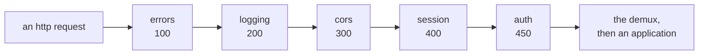

# Middleware

**Version**: 0.4 · **Last Updated**: 2026-09-08 · **Status**: 🔴 DA REVISIONARE

The middleware chain every request passes through on its way in and on its way
out, and the five things this core puts in it.

## What a middleware is

A middleware is an ASGI layer around the dispatch. It can inspect a request,
wrap the response, or refuse the request before an application handles it.

An application answers requests. It should not also be deciding whether the
caller is who they say they are, whether a browser from another origin may
read the answer, what to do when something raises, or whether this request
deserves a line in a log. Those questions have the same answer for every
application on the machine, and an application that answered them itself would
answer them differently from the one beside it.

A **middleware** is a layer wrapped around the dispatch. It sees the request
before the server decides who will serve it, and it sees the answer on the way
out. It can look, it can add, it can answer instead, and it can refuse — and
it does any of that for every request, whichever application the request was
going to.

There are exactly two extension points in this framework and they are easy to
confuse. A **plugin** is armed on one application's routing tree and sees the
tree, never the traffic. A **middleware** wraps the dispatch and sees the
traffic, never the tree. The test that separates them: a middleware can answer
a request that matched no route at all, and a plugin cannot.

> Plugins are [025 routing system](../025_routing-system/README.md).

## The anatomy

The chain is assembled once, when the server is built, and every HTTP request
walks it in and back out. Requests that are not HTTP do not enter it.



| The part | In one line |
|---|---|
| the middleware chain and its order | one number per layer, and why the order is the design |
| assembly | built once, from an explicit list, with no global registry |
| the five | what each one does, and what it puts on the request |
| the outermost layer | the one that turns a raised exception into an answer |
| what the middleware chain does not see | and why that is a decision, not an omission |
| what a site writes | the switches, and what the capabilities arm by themselves |
| writing one | the base class, the two attributes, and how it is installed |

---

## 1. The middleware chain, and why the order is the design

Each layer declares **one number**, and the chain is sorted by it: the lowest
number ends up outermost, closest to the network. That is the whole ordering
mechanism — no list to maintain, no dependency graph, no registration order to
get right. A layer states where it belongs and the chain forms itself.

| Layer | `middleware_order` | Outside it | On in a shipped server? |
|---|---|---|---|
| errors | 100 | nothing | **yes**, unless switched off |
| logging | 200 | errors | only if named |
| cors | 300 | errors, logging | only if named |
| session | 400 | and cors | **yes** — its own capability arms it |
| auth | 450 | and session | **yes** — its own capability arms it |

The last column is worth reading carefully, because two different things decide
it. Every layer declares a `middleware_default`, and only errors sets it true.
But **a capability arms its own layer**: composing a server with sessions puts
the session layer in the middleware chain, and composing one with identity puts
the identity layer in, without anybody naming either in the description. A site
that wants them out says so explicitly — an explicit `False` always wins.

Three of those positions carry an argument, and each is the kind of thing that
is obvious once stated and expensive to discover.

**Errors is outermost** because it must be able to answer anything anybody
inside raised — including another middleware. A layer that raises is not a
crash; it is a layer delegating the answer outwards.

**Session is outside auth** because the identity may come from the session.
Reversed, the layer that resolves who is calling would run before the session
it is supposed to read, and the fallback would silently never fire.

**Cors is outside session** because a preflight — the browser's question *may I
even send this?* — should be answered without minting a session for a request
that carries no user and may never be followed by one.

The order is stated once, on the classes, and read once, when the chain is
built. Nothing at request time consults it.

---

## 2. Assembly — once, from an explicit list

The chain is built when the server is constructed and never rebuilt. It is
assembled from three explicit inputs: the **registry** of what may be in the
chain (a mapping from name to class), the **switches** that say which of them
are on, and the **innermost target**, which is the server's own dispatch.

Nothing about that is ambient. There is **no module-level registry** and
nothing registers itself when a module is imported: the mapping is produced by
a call, so each server has its own and two servers in one process cannot write
into each other's. A name in the switches that the registry does not know
stops the construction with an error naming it.

Each layer receives **both ends at construction**: the next layer inwards, and
the server that owns it. Neither is discovered by walking wrappers at request
time, which is what keeps a layer readable on its own — it has what it needs
as attributes, not as a search.

A layer that is switched on with a **dict** rather than `True` gets that dict
as its constructor options, and an option nobody declared is refused by name.

---

## 3. The five, and what each leaves on the request

**errors** — turns anything raised into an answer. Block 4.

**logging** — one line when a request arrives, one when it leaves, with the
method, the path, the status and the elapsed milliseconds. Its logger is its
own instance's, never a module-level one, so a deployment can turn one
server's access log up without touching another's.

**cors** — answers the browser's preflight `OPTIONS` and adds the
cross-origin headers to ordinary answers. What it allows is configured;
nothing is allowed by default.

**session** — reads the session cookie, reconnects the session it names or
creates a new anonymous one, and leaves it on the request. It issues a
`Set-Cookie` **only when it created one**: a login attaches an identity to the
session already in hand rather than making a new one, so the cookie the client
holds stays valid and no other answer carries a cookie. It writes the session
back at the end of the request **only if something changed it**, so a
read-only request costs no storage.

**auth** — asks the server who is calling and leaves the answer on the
request: an identity, or nobody. It decides nothing else. A credential that is
present and wrong raises, and errors answers 401.

> Sessions are [040 sessions](../040_sessions/README.md) and identity is
> [050 authentication](../050_authentication/README.md); this page only says where in
> the middleware chain they sit and what they leave behind.

The two that leave something behind — the session and the identity — are why
the middleware chain exists at all: everything downstream, the route resolution
included, reads what these two put there.

---

## 4. The outermost layer — from a raised exception to an answer

Anything raised anywhere inside the middleware chain arrives here, and this is
the only place an exception becomes a response. That is what lets a handler, or
a layer, or the route resolution itself simply **raise** the answer it wants:
`404`, `401`, `403`, a redirect. Nobody builds an error response by hand.

What comes out depends on who is asking, and on two questions.

**What kind of body?** An error's body follows the caller's `Accept`. A caller
asking for JSON gets `{"error": "<the detail>"}`; a browser, and a caller that
asked for nothing, get the detail as plain text. The default is text because that is what the wire
carried before the negotiation existed, and changing an old default silently
is worse than an inelegant one.

**Is a 401 an answer, or an invitation?** When the installation has a login
surface, a 401 is where the server asks the caller to identify themselves —
and the right way to ask depends on who they are. A **browser navigation** gets
a `302` to the login page, carrying where it was going so the login can send
it back. **Anything else** keeps the bare 401, its authentication challenge
header, and gains a body naming the login URL so an application can drive the
login itself. With no login surface, a 401 is just a 401.

**One thing cannot be answered.** If the exception is raised after the answer
has already started going out, there is no response left to build: a second
start would corrupt what the client is already reading. It is logged and
re-raised, and the connection dies. This is the reason the layer wraps the
outgoing side at all — it has to know whether it still may speak.

---

## 5. What the middleware chain does not see

**Only HTTP enters it.** A WebSocket connection and the server's own
start-and-stop conversation go straight past, to the server. So no layer here
sees a socket, and none of them can act on one.

That is a boundary worth naming rather than passing over, because two of these
layers are exactly what a socket would want: the origin check before a
handshake is accepted, and the identity resolved before the conversation
begins. Neither middleware layer runs on a WebSocket scope. WSX handshake processing
performs those checks once; a raw application owns its handshake policy.

> [055 WebSocket](../055_websocket/README.md).

**And the middleware chain does not know applications.** It runs before the
server has decided who will serve the request, so a layer cannot be armed for
one application and not another. The middleware chain is the machine's,
uniformly. An application that wants something of its own puts it in its own
tree, where a plugin is the tool.

---

## 6. What a site writes

One section, one switch per layer:

```python
cfg.middleware(
    logging=True,
    cors={"allow_origins": "https://shop.example.com"},
)
```

`True` turns a layer on with its own defaults; a dict turns it on and becomes
its options; `False` turns off one that would otherwise be on.

**Three of the five are not in that list and are on anyway.** Errors is on by
its own default, so a server with no middleware section still answers its
exceptions. The session and identity layers are armed by the capabilities they
belong to, so a server composed with sessions has the session layer whether or
not the description mentions it. Naming them changes nothing; naming one
`False` is how a site removes it.

> The section's place in the description is
> [015 configuration](../015_configuration/README.md).

---

## 7. BaseMiddleware extension and StampMiddleware example

A layer is a subclass of `BaseMiddleware`. It declares **where it goes** and
**whether it is on when nobody says**, and it implements the ASGI call:

```python
from kajenn.middleware import BaseMiddleware


class StampMiddleware(BaseMiddleware):
    """Adds a header naming which machine served the request."""

    middleware_order = 250          # between logging (200) and cors (300)
    middleware_default = False      # off unless a site asks for it

    def __init__(self, app, server, machine="unknown", **options):
        super().__init__(app, server, **options)
        self._machine = machine

    async def __call__(self, scope, receive, send):
        async def stamped(message):
            if message["type"] == "http.response.start":
                headers = list(message.get("headers", []))
                headers.append((b"x-served-by", self._machine.encode()))
                message = {**message, "headers": headers}
            await send(message)

        await self.app(scope, receive, stamped)
```

Three things in that shape are the contract.

**The constructor takes both ends and forwards the rest.** `app` is the next
layer inwards, `server` is the owner; a layer peels its own options and hands
what is left to `super().__init__`, which refuses anything nobody claimed by
naming it. `self.app`, `self.server` and `self.logger` are the properties it
then works with.

**Touching the answer means wrapping `send`.** A layer that only reads the
request calls `self.app(scope, receive, send)` and is done. A layer that adds
to the answer passes its own callable, as above.

**Refusing means raising.** A layer that wants to answer 404 raises
`HTTPNotFound` from `kajenn.exceptions` and lets the outermost layer build
the response, exactly as the probe filter does.

**Installing it takes two arguments, both at construction:**

```python
server = AsgiServer(
    config=ServerConfiguration,
    middleware={"stamp": {"machine": "web-01"}},
    middleware_registry={"stamp": StampMiddleware},
)
```

That server's middleware chain is `ErrorMiddleware · StampMiddleware ·
SessionMiddleware · AuthMiddleware`. Responses emitted through `StampMiddleware`
carry `x-served-by: web-01`. If downstream processing raises, the outer
`ErrorMiddleware` generates the error response outside that wrapper, so the
header is absent from that response.

The asymmetry with the five is deliberate and worth stating: **a middleware of
your own cannot be named in the description.** The section's words are the five
core names and no others, so `middleware=` at construction is the only way in —
and because the description is mapped onto that same argument, a site that has
both a description and a hand-passed switch has two writers for one value.

---

## Shared capabilities and application contracts

Every request served by an installation of this core passes through the
middleware chain, so the identity the route resolution filters on and the
session a handler reads are both put there by it. The administrative surface's
login flow is the outermost layer's challenge negotiation seen from the other
side.

## A configuration that includes it

A whole installation with the middleware chain armed: the probe filter, the
access log, and cross-origin access for one site. Sessions and identity are not
named — their own capabilities arm them.

```python
import tempfile

from genro_routes import route

from kajenn import AsgiServer, RoutedApplication
from kajenn.config import BaseConfiguration


class Shop(RoutedApplication):
    """One public route and one that refuses whoever is not an admin."""

    mount = ""

    @route()
    def home(self) -> dict[str, str]:
        return {"shop": "open"}

    @route(auth_rule="admin")
    def takings(self) -> dict[str, int]:
        return {"today": 42}


# The local storage backend refuses a directory that is not there; a real
# deployment names its own.
SITE_DIR = tempfile.mkdtemp(prefix="shop-")


class ServerConfiguration(BaseConfiguration):
    """The middleware chain: errors is on by default, the rest is named here."""

    def main(self, root):
        cfg = root.configuration()
        self.server_section(cfg)
        self.storage_section(cfg)
        cfg.middleware(
            logging=True,
            cors={"allow_origins": "https://shop.example.com"},
        )
        cfg.applications().application(code="shop", app_class=Shop)

    def storage_mounts(self, section):
        section.local(name="site", base_path=SITE_DIR)


server = AsgiServer(config=ServerConfiguration)
```

`BaseConfiguration` is the package's own defaults written as a recipe, and
`server_section` / `storage_section` are two of its hooks — which is why `main`
calls two methods it does not define, and defines a third (`storage_mounts`)
that the inherited `storage_section` calls. That mechanism belongs to
[015 configuration](../015_configuration/README.md).

Walking the chain outwards from `server.middleware_chain` gives the five in
order:

```
ErrorMiddleware · LoggingMiddleware · CORSMiddleware · SessionMiddleware · AuthMiddleware
```

And the installation answers:

| Request | Answer |
|---|---|
| `GET /home` | 200 `{"shop": "open"}`, plus `set-cookie: session_id=…` for the new session |
| `GET /takings`, `Accept: application/json` | **401** with `{"error": "…"}` and the `WWW-Authenticate` challenge |
| `GET /takings`, `Accept: text/html` | **401** `text/plain`, the same challenge header |
| `OPTIONS /home` with `Origin` and `Access-Control-Request-Method` | 200, `access-control-allow-origin: https://shop.example.com` |

The two `/takings` rows are the same route, the same refusal and the same
caller-less request. They differ only in the body format, which follows
`Accept`: the status and the challenge header are the same for both. The core
never points a caller at a login page — it owns none (D-SA-4); an application
that has one redirects from its own routes.

Hidden paths are not in this table because they are not the chain's business:
a first segment starting with a dot answers 404 in the server's own demux,
under every layer here, and no switch turns it off (issue #88 — see
`docs/guides/hidden-paths.md`). A probe WITHOUT a dot — `/robots.txt` — is an
ordinary path and reaches the shop.
