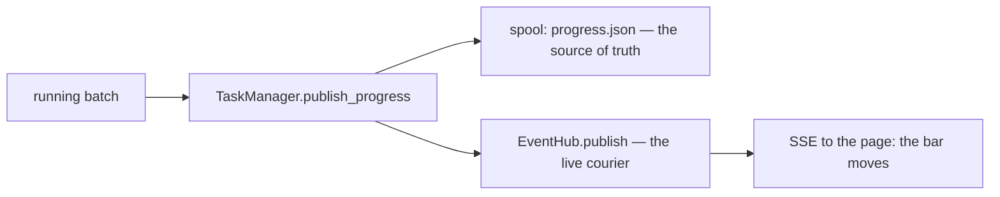

# Task thermometers (termometri)

**Version**: 0.1 · **Last Updated**: 2026-09-08 · **Status**: 🔴 DA REVISIONARE

**The need.** Whoever launches a long batch wants to see it move while it runs, and to stop it politely without corrupting its work.

The live progress of a running batch: `TaskManager.publish_progress`
writes the `progress.json` snapshot on the spool AND publishes the same
data on the live event channel in one paired call, so a page shows the bar
while it moves. Cooperative interruption: the stop request is a signal the
batch reads at its own pace, and the intermediate 'stopping' state stays
visible.

Interactions: tasks (spool = source of truth) · SSE/event hub (the live courier).

## TaskManager.publish_progress persistence and live events

`TaskManager.publish_progress` writes the spool snapshot and publishes the
same progress on the live event channel. The task’s active worker performs
both operations in one call.

One paired call, always both legs: a progress written anywhere else than the
task's ACTIVE worker is a bug, not a variant.
